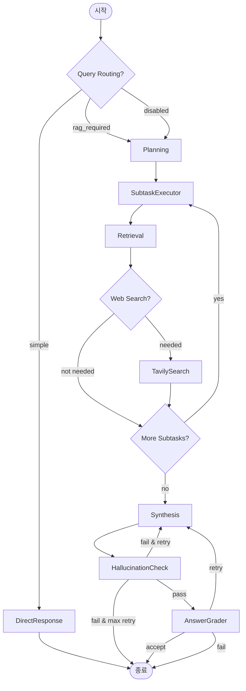

# Multimodal RAG System - 답변 생성 프로세스 상세 분석

## 📊 데이터베이스 현황 (2025-01-04 기준)

### 테이블 구조
**테이블명**: `mvp_ddu_documents`

#### 주요 컬럼
- **id**: integer (Primary Key)
- **source**: text (문서 경로)
- **page**: integer (페이지 번호) 
- **category**: text (문서 유형)
- **page_content**: text (원본 내용)
- **translation_text**: text (번역 텍스트)
- **contextualize_text**: text (맥락화된 텍스트)
- **caption**: text (캡션)
- **entity**: jsonb (구조화된 엔티티 정보)
- **image_path**: text (이미지 경로)
- **human_feedback**: text (사람의 피드백)
- **embedding_korean**: vector(1536) (한국어 임베딩)
- **embedding_english**: vector(1536) (영어 임베딩)
- **search_vector_korean**: tsvector (한국어 FTS)
- **search_vector_english**: tsvector (영어 FTS)

#### 인덱스
- IVFFlat 인덱스: 벡터 검색용 (korean/english)
- GIN 인덱스: Full-Text Search용 (korean/english)
- B-tree 인덱스: 메타데이터 필터링용 (source, category, page)

### 데이터 통계
- **총 문서**: 280개
- **카테고리 분포**:
  - paragraph: 182개 (65.0%)
  - heading1: 57개 (20.4%)
  - table: 14개 (5.0%)
  - figure: 13개 (4.6%)
  - header: 5개 (1.8%)
  - list: 5개 (1.8%)
  - caption: 4개 (1.4%)

- **소스 문서**:
  - `디지털정부혁신_추진계획.pdf`: 158개 (pages 1-10)
  - `gv80_owners_manual_TEST6P.pdf`: 122개 (pages 1-6)

- **Entity 데이터**: 36개 문서 (주로 table, figure)
- **Human Feedback**: 0개 (아직 없음)
- **임베딩 상태**:
  - 한국어: 280/280 (100%)
  - 영어: 255/280 (91%)

## 🔄 워크플로우 아키텍처

### 노드 구성 (총 11개)

#### 1. Query Routing 노드 (Entry Points)
- **QueryRouterNode**: LLM 기반 쿼리 분류 (simple/rag_required/history_required)
- **DirectResponseNode**: 단순 쿼리 직접 응답
- **ContextEnhancementNode**: 대화 히스토리 참조 해결 (제거됨, MessagesState 사용)

#### 2. 핵심 실행 노드 (P-E-O Pattern)
- **PlanningAgentNode**: 쿼리를 1-5개 서브태스크로 분해
- **SubtaskExecutorNode**: 각 서브태스크를 3-5개 Multi-Query로 변형
- **RetrievalNode**: 하이브리드 검색 실행 (semantic + keyword + filter)
- **SynthesisNode**: 구조화된 답변 생성

#### 3. 품질 검증 노드 (CRAG Pattern)
- **HallucinationCheckNode**: 환각 검증 (threshold=0.7)
- **AnswerGraderNode**: 4차원 품질 평가 (threshold=0.6)

#### 4. 보조 노드
- **TavilySearchTool**: 웹 검색 폴백
- **graph.py**: LangGraph 오케스트레이션 엔진

### 워크플로우 실행 흐름



## 📝 답변 생성 프로세스 (Synthesis Node)

### 1. 문서 준비 단계

#### 우선순위 계층구조
1. **최우선**: Human Verified Content (human_feedback 필드)
2. **높음**: Structured Entity Data
   - **똑딱이 (PPT Embedded Documents)**: PPT 프레젠테이션의 구조화된 메타데이터
   - **Tables**: 제목, 상세 설명, 키워드를 포함한 구조화된 테이블 데이터
   - **Figures**: 설명과 맥락 데이터를 포함한 시각 정보
3. **표준**: Document Content (page_content 필드)

#### 특수 처리
- **똑딱이 Entity**: 항상 "PPT 삽입 문서" 또는 "PPT Embedded Document"로 명시
- **Page Images**: 참조된 문서의 페이지 이미지를 마크다운 형식으로 포함
- **Warnings**: 문서에서 경고/주의사항 자동 추출 (최대 5개)

### 2. 답변 생성 단계

#### 프롬프트 구조
```python
# 문서별 포맷
[{idx}] Document Reference:
- Source: {source}
- Page: {page}
- Category: {category}
- Content: {content}
- Caption: {caption}  # if exists
- Entity Info: {entity_info}  # if exists
- Human Verified: {human_feedback}  # if exists
- Page Image Available: {path}  # if exists
```

#### LLM 생성 전략
- **Model**: GPT-4o-mini
- **Temperature**: 0.1 (일관된 답변)
- **Structured Output**: SynthesisResult 스키마
  - answer: 인라인 인용 포함 답변
  - confidence: 신뢰도 점수 (0.0-1.0)
  - sources_used: 사용된 참조 리스트 ['[1]', '[2]']
  - key_points: 핵심 포인트 리스트
  - references_table: 참조 테이블 (필수)
  - page_images: 페이지 이미지 정보
  - entity_references: 참조된 entity 정보
  - human_feedback_used: 사용된 human feedback
  - warnings: 추출된 경고사항

#### Token Limit 처리
1. **첫 시도**: 전체 문서 사용
2. **Fallback**: Token 제한 초과시 문서 500자로 축약
3. **페이지 이미지**: 항상 전체 포함 (축약 모드에서도)

### 3. 품질 검증 단계 (CRAG Pattern)

#### 환각 체크 (HallucinationCheckNode)
- **임계값**: 0.7 (hallucination_score)
- **평가 프로세스**:
  1. 답변에서 모든 사실적 주장 추출
  2. 각 주장을 원본 문서와 대조
  3. 지원되지 않는 주장 식별
  4. 환각 점수 계산 (0.0-1.0)
  
- **점수 기준**:
  - 0.0: 모든 주장이 문서에 지원됨
  - 0.1-0.3: 미미한 지원되지 않는 세부사항
  - 0.4-0.6: 일부 지원되지 않는 주장
  - 0.7-0.9: 주요 지원되지 않는 주장
  - 1.0: 완전히 조작된 답변

- **재시도 메커니즘**:
  - 점수 > 0.7시 재시도
  - 보수적 답변 생성 (corrective generation)
  - 최대 3회 재시도

#### 답변 품질 평가 (AnswerGraderNode)
- **임계값**: 0.6 (overall_score)
- **평가 차원**:
  1. **Completeness**: 쿼리의 모든 부분에 답변했는가?
  2. **Relevance**: 답변이 쿼리와 관련이 있는가?
  3. **Clarity**: 답변이 명확하고 이해하기 쉬운가?
  4. **Accuracy**: 답변이 사실적으로 정확한가?

- **재시도 트리거**:
  - Overall score < 0.6
  - 개별 차원 점수 < 0.5
  - 최대 3회 재시도

### 4. 재시도 전략

#### Corrective Generation (환각 실패시)
```python
# 보수적 생성 지침
- 문서에 명시된 내용만 사용
- 문제가 된 주장 회피
- 모든 문장에 참조 번호 포함
- 정보 없을시 명시: "문서에 해당 정보가 없습니다"
- Temperature: 0.1 → 0.05로 감소
```

#### Improved Generation (품질 실패시)
```python
# 개선된 생성 지침
- 피드백 기반 개선
- 부족한 차원 강화
- 더 명확한 구조화
- 추가 키포인트 포함
```

## 🎯 State 관리 (MVPWorkflowState)

### 핵심 State 필드 (총 68개)

#### 입력/출력
- `query`: 원본 사용자 쿼리
- `enhanced_query`: 컨텍스트 개선된 쿼리
- `final_answer`: 최종 생성 답변

#### 실행 상태
- `subtasks`: 분해된 서브태스크 리스트
- `current_subtask_idx`: 현재 처리 중인 인덱스
- `subtask_results`: 누적 결과 (Annotated[List, add])
- `documents`: 검색된 문서들 (clearable_add reducer)

#### 품질 체크
- `hallucination_check`: 환각 체크 결과
- `answer_grade`: 품질 평가 결과
- `confidence_score`: 신뢰도 점수
- `retry_count`: 재시도 횟수

#### 제어 플래그
- `query_type`: simple/rag_required/history_required
- `workflow_status`: running/completed/failed
- `should_retry`: 재시도 필요 여부
- `next_node`: 조건부 라우팅용

## 🚀 성능 메트릭

### 검색 성능
- **한국어 키워드 검색**: 80.6% relevance
- **영어 키워드 검색**: 91.1% relevance
- **시맨틱 검색**: 평균 유사도 0.621
- **하이브리드 검색**: ~378ms

### 워크플로우 성능
- **Simple Query** (Query Router → Direct Response): ~4.27초
- **RAG Query** (Full Pipeline): ~20-30초
- **재시도 포함**: 추가 10-15초/회

### 병렬성
- **ThreadPoolExecutor**: max_workers=3
- **병렬 효율**: 132.4%
- **이론적 속도 향상**: 6.62x

## 🔧 환경 설정

### 주요 환경변수
```env
# LLM 설정
OPENAI_MODEL=gpt-4o-mini
OPENAI_EMBEDDING_MODEL=text-embedding-3-small
OPENAI_EMBEDDING_DIMENSIONS=1536

# 검색 설정
SEARCH_RRF_K=60
SEARCH_DEFAULT_TOP_K=10
SEARCH_DEFAULT_SEMANTIC_WEIGHT=0.5
SEARCH_DEFAULT_KEYWORD_WEIGHT=0.5

# CRAG 설정
CRAG_HALLUCINATION_THRESHOLD=0.7
CRAG_ANSWER_QUALITY_THRESHOLD=0.6
CRAG_MAX_RETRIES=3

# 워크플로우 설정
ENABLE_QUERY_ROUTING=true
LANGGRAPH_PLANNING_MAX_SUBTASKS=5
```

## 💡 핵심 특징

1. **이중 언어 지원**: 한국어/영어 동시 임베딩 및 검색
2. **하이브리드 검색**: 시맨틱 + 키워드 + 필터 조합
3. **구조화된 Entity**: 똑딱이, 테이블, 그림 메타데이터
4. **CRAG 패턴**: 환각 체크 + 품질 평가 + 재시도
5. **Multi-Query**: 각 서브태스크를 3-5개 변형으로 확장
6. **페이지 이미지**: 마크다운 형식으로 답변에 포함
7. **우선순위 시스템**: Human Feedback > Entity > Raw Content

## 📌 주의사항

1. **Empty Documents 처리**: Synthesis와 HallucinationCheck는 빈 문서 리스트에서 실패
2. **똑딱이 Entity**: 반드시 "PPT 삽입 문서"로 명시 필요
3. **Token Limit**: 문서 과다시 자동 축약 (500자)
4. **재시도 제한**: 최대 3회, 이후 실패 처리
5. **병렬 처리**: ThreadPoolExecutor로 검색 병렬화 (asyncio 제거됨)
