# Multimodal RAG Project - Deep Architecture Analysis
*Generated: 2025-09-04*

## 📊 Database State & Schema

### Current Data Status
- **Total Documents**: 280 documents
- **Sources**: 2 PDFs
  - `data/gv80_owners_manual_TEST6P.pdf` (자동차 매뉴얼)
  - `data/디지털정부혁신_추진계획.pdf` (정부 정책 문서)
- **Pages**: 1-10 (10 unique pages)
- **Documents with Entity Data**: 280 (100%)

### Category Distribution
```
paragraph: 182 documents (65%)
heading1:   57 documents (20.4%)
table:      14 documents (5%)
figure:     13 documents (4.6%)
header:      5 documents (1.8%)
list:        5 documents (1.8%)
caption:     4 documents (1.4%)
```

### Database Schema (mvp_ddu_documents)
```sql
id                    INTEGER          -- Primary key
source                TEXT             -- Source PDF path
page                  INTEGER          -- Page number
category              TEXT             -- DDU category (14 types)
page_content          TEXT             -- Original text content
translation_text      TEXT             -- Translated text
contextualize_text    TEXT             -- Contextualized text
caption               TEXT             -- Caption for figures/tables
entity                JSONB            -- Structured entity data
image_path            TEXT             -- Path to image file
human_feedback        TEXT             -- Human annotations
created_at            TIMESTAMP        -- Creation timestamp
updated_at            TIMESTAMP        -- Update timestamp
embedding_korean      VECTOR(1536)     -- Korean text embedding
embedding_english     VECTOR(1536)     -- English text embedding
search_vector_korean  TSVECTOR         -- Korean FTS vector
search_vector_english TSVECTOR         -- English FTS vector
```

### Indexes
- **IVFFlat**: Vector similarity search (embedding_korean, embedding_english)
- **GIN**: Full-text search (search_vector_korean, search_vector_english)
- **B-tree**: Metadata queries (source, page, category)

## 🔄 Workflow Architecture

### Workflow Nodes (11 Total)

#### Entry & Routing Nodes
1. **QueryRouterNode** (`workflow/nodes/query_router.py`)
   - LLM-based query classification
   - Classifies: simple, rag_required, history_required
   - Dynamic examples from DB

2. **DirectResponseNode** (`workflow/nodes/direct_response.py`)
   - Handles simple queries without RAG
   - Temperature: 0.7 for natural responses

#### Core RAG Pipeline
3. **PlanningAgentNode** (`workflow/nodes/planning_agent.py`)
   - Decomposes query into 1-5 subtasks
   - Priority assignment (1-5)
   - Dependency tracking

4. **SubtaskExecutorNode** (`workflow/nodes/subtask_executor.py`)
   - Generates 3-5 query variations per subtask
   - Dynamic filter generation
   - Language detection

5. **RetrievalNode** (`workflow/nodes/retrieval.py`)
   - Dual-language search (Korean + English)
   - Hybrid search: Semantic + Keyword
   - RRF merging (k=60)
   - ThreadPoolExecutor for parallelization

6. **SynthesisNode** (`workflow/nodes/synthesis.py`)
   - Structured answer generation
   - Entity information formatting
   - Human feedback prioritization
   - Token limit: 6000

#### Quality Assurance (CRAG)
7. **HallucinationCheckNode** (`workflow/nodes/hallucination.py`)
   - Validates against source documents
   - Threshold: 0.7
   - Max retries: 3

8. **AnswerGraderNode** (`workflow/nodes/answer_grader.py`)
   - 4-dimension quality assessment
   - Completeness, Relevance, Clarity, Accuracy
   - Threshold: 0.6

#### Supplementary
9. **TavilySearchTool** (`workflow/tools/tavily_search.py`)
   - Web search fallback
   - Triggers when documents < 3
   - Max results: 3

## 📈 State Management

### MVPWorkflowState (96 fields)
Extends `MessagesState` for chat history support

#### Key Field Categories
1. **Input**: query, messages (chat history)
2. **Planning**: subtasks, current_subtask_idx, subtask_results
3. **Multi-Query**: query_variations (3-5 per subtask)
4. **Retrieval**: documents (clearable_add), search_filter, search_language
5. **Synthesis**: intermediate_answer, final_answer, confidence_score
6. **CRAG**: hallucination_check, answer_grade, retry_count
7. **Control**: iteration_count, should_use_web, workflow_status
8. **Routing**: query_type, enhanced_query, current_node
9. **Metadata**: execution_time, warnings, errors

### Special Reducers
- **clearable_add**: Allows document list clearing for multi-turn conversations
- **add**: Accumulates values in lists

## 🎯 Workflow Execution Flow

### Entry Points


### Main RAG Pipeline

```mermaid
graph TD
    Planning --> SE[Subtask Executor]
    SE -->|continue| Retrieval
    SE -->|complete| Synthesis
    SE -->|failed| End
    Retrieval -->|<3 docs| WebSearch
    Retrieval -->|≥3 docs| SE
    WebSearch --> SE
    Synthesis --> HC[Hallucination Check]
    HC -->|valid| AG[Answer Grader]
    HC -->|retry| Synthesis
    HC -->|failed| End
    AG -->|accept| End
    AG -->|retry| Synthesis
    AG -->|failed| End
```


## 🔀 State Transitions

### Conditional Edge Functions
1. **route_query** (query_router)
   - Input: query_type from state
   - Output: "direct_response" | "planning"

2. **_should_continue_subtasks** (subtask_executor)
   - Checks: error, workflow_status, current_subtask_idx
   - Output: "continue" | "complete" | "failed"

3. **_should_web_search** (retrieval)
   - Checks: document count < 3, require_web_search flag
   - Output: "search" | "continue"

4. **_check_hallucination** (hallucination_check)
   - Checks: is_valid, needs_retry, retry_count
   - Output: "valid" | "retry" | "failed"

5. **_check_answer_quality** (answer_grader)
   - Checks: is_satisfactory, all dimensions ≥ threshold
   - Output: "accept" | "retry" | "failed"

## ⚡ Performance Characteristics

### Search Performance
- **Korean Search**: 80.6% relevance score
- **English Search**: 91.1% relevance score
- **Hybrid Search Time**: ~378ms average
- **Semantic Weight**: 0.5 (configurable)
- **Keyword Weight**: 0.5 (configurable)

### Workflow Timing
- **Simple Query** (direct response): ~4.27 seconds
- **RAG Query** (full pipeline): 20-30 seconds
- **Document Ingestion**: 0.550 seconds/document

### Concurrency Settings
- **ThreadPoolExecutor**: max_workers=3
- **DB Connection Pool**: min=5, max=10
- **Recursion Limit**: Dynamic (subtasks×3 + retries×4 + 30)

## 🔧 Configuration

### Environment Variables (Key)
```bash
# OpenAI
OPENAI_MODEL=gpt-4o-mini
OPENAI_EMBEDDING_MODEL=text-embedding-3-small
OPENAI_EMBEDDING_DIMENSIONS=1536

# Database
DB_TABLE_NAME=mvp_ddu_documents
DB_HOST=localhost
DB_PORT=5432

# Search
SEARCH_RRF_K=60
SEARCH_DEFAULT_TOP_K=10
SEARCH_DEFAULT_SEMANTIC_WEIGHT=0.5
SEARCH_DEFAULT_KEYWORD_WEIGHT=0.5

# Query Routing
ENABLE_QUERY_ROUTING=true
SEARCH_MAX_RESULTS=20

# Quality Control
CRAG_MAX_RETRIES=3
LANGGRAPH_PLANNING_MAX_SUBTASKS=5
```

## 🏗️ Data Processing Pipeline

### Phase 0: Document Processing
```
PDF Files → DDU Parser → Pickle Files (14 categories)
```

### Phase 1: Ingestion
```
Pickle Files → Loader → Dual Embeddings → PostgreSQL + pgvector
```

### Phase 2: RAG Execution
```
Query → Router → Planning → Multi-Query → Hybrid Search → Synthesis → CRAG → Answer
```

## 📝 Key Implementation Details

### Synchronous Architecture
- **Migration**: asyncpg → psycopg3 (completed 2025-08-31)
- **Reason**: LangGraph API Server ASGI compatibility
- **Pattern**: ThreadPoolExecutor for parallelization

### Multi-Language Support
- **Dual Embeddings**: Korean + English vectors
- **Dual FTS**: Korean (Kiwi) + English (spaCy) tokenization
- **Language Detection**: Automatic in SubtaskExecutor

### Entity & Human Feedback Integration
- **Priority**: Human Feedback > Entity Data > Raw Content
- **Storage**: JSONB for structured entity data
- **Search**: Entity keywords included in FTS vectors

### Error Handling
- **Retry Mechanism**: Max 3 retries for synthesis
- **Fallback**: Web search when local retrieval fails
- **State Preservation**: Errors tracked but workflow continues

## 🚀 Recent Improvements

1. **Query Routing** (2025-08-14)
   - 90% response time reduction for simple queries
   - Context-aware routing with chat history

2. **Entity Integration** (2025-08-20)
   - Table/Figure structured data support
   - Human feedback prioritization

3. **Async to Sync Migration** (2025-08-31)
   - Full psycopg3 migration
   - ASGI compatibility achieved

4. **Dynamic Examples** (2025-08-29)
   - Real-time DB content for query routing
   - Improved classification accuracy

## 📊 System Metrics Summary

- **Database Size**: 280 documents across 10 pages
- **Workflow Nodes**: 11 specialized nodes
- **State Fields**: 96 fields in central state
- **Search Accuracy**: 85.8% average relevance
- **Processing Time**: 4-30 seconds depending on complexity
- **Concurrency**: 3 parallel workers, 10 DB connections
- **Quality Gates**: 2-stage CRAG validation

## 🔍 Key Files Structure
```
multimodal-rag-wsl-v2/
├── workflow/
│   ├── graph.py              # Main orchestration (670 lines)
│   ├── state.py              # State definitions (127 lines)
│   └── nodes/               # 9 workflow nodes
│       ├── query_router.py
│       ├── planning_agent.py
│       ├── subtask_executor.py
│       ├── retrieval.py
│       ├── synthesis.py
│       └── ...
├── retrieval/
│   ├── hybrid_search.py     # RRF hybrid search
│   └── search_filter.py     # Dynamic filtering
├── ingest/
│   ├── database.py          # psycopg3 connection pool
│   ├── embeddings.py        # Dual language embeddings
│   └── models.py            # DDU schema definitions
└── scripts/
    ├── 1_phase1_setup_database.py
    ├── 2_phase1_ingest_documents.py
    └── 3_phase2_test_workflow.py
```