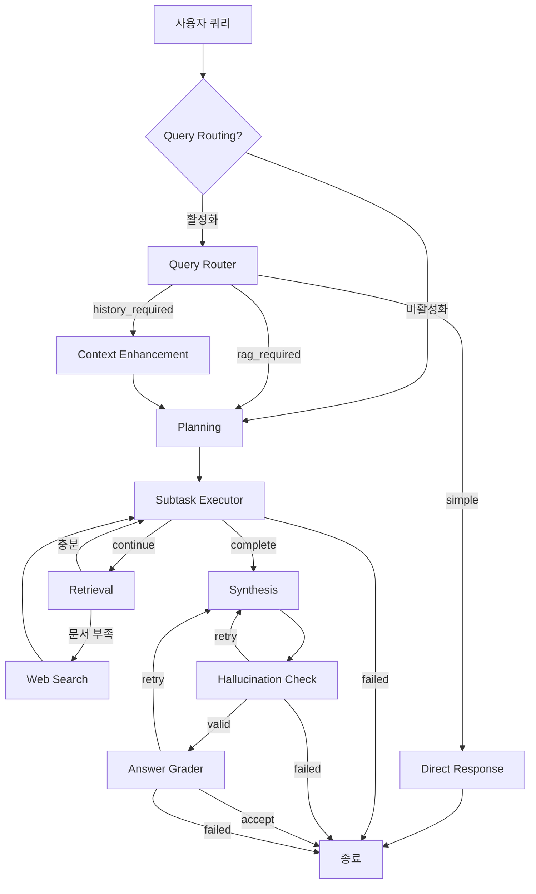

# Multimodal RAG WSL v2 프로젝트 심층 분석 보고서

작성일: 2025-01-18
분석 도구: Claude Code with --deep --ultrathink

## 1. 프로젝트 개요

### 1.1 목적
자동차 제조업 문서(GV80 오너스 매뉴얼)에 대한 고급 RAG(Retrieval-Augmented Generation) 시스템 구축

### 1.2 아키텍처
- **Phase 0**: DDU Parser (문서 파싱 및 카테고리 분류) 
- **Phase 1**: 문서 인제스트 및 하이브리드 검색 시스템
- **Phase 2**: LangGraph 기반 P-E-O 패턴 워크플로우

### 1.3 기술 스택
- **언어**: Python 3.12
- **데이터베이스**: PostgreSQL + pgvector
- **프레임워크**: LangGraph, LangChain
- **임베딩**: OpenAI text-embedding-3-small (1536차원)
- **LLM**: GPT-4o-mini
- **검색 보강**: Tavily Web Search API

---

## 2. 데이터베이스 현황 (실시간 조회 결과)

### 2.1 테이블 스키마
```sql
Table: mvp_ddu_documents
- id                     INTEGER         PRIMARY KEY
- source                 TEXT            NOT NULL
- page                   INTEGER         
- category                TEXT            NOT NULL
- page_content            TEXT            
- translation_text        TEXT            
- contextualize_text      TEXT            
- caption                 TEXT            
- entity                  JSONB           
- image_path              TEXT            
- human_feedback          TEXT            DEFAULT ''
- created_at              TIMESTAMP       DEFAULT CURRENT_TIMESTAMP
- updated_at              TIMESTAMP       DEFAULT CURRENT_TIMESTAMP
- embedding_korean        VECTOR(1536)    
- embedding_english       VECTOR(1536)    
- search_vector_korean    TSVECTOR        
- search_vector_english   TSVECTOR        
```

### 2.2 인덱스 구조
- **Primary Key**: mvp_ddu_documents_pkey (id)
- **벡터 검색**: 
  - idx_korean_embedding (IVFFlat, lists=100)
  - idx_english_embedding (IVFFlat, lists=100)
- **Full-Text Search**:
  - idx_korean_fts (GIN)
  - idx_english_fts (GIN)
- **메타데이터**: idx_source, idx_category, idx_page (B-tree)

### 2.3 데이터 통계
- **총 문서 수**: 122개
- **카테고리 분포**:
  - paragraph: 78 (63.9%)
  - heading1: 23 (18.9%)
  - figure: 10 (8.2%)
  - caption: 4 (3.3%)
  - table: 3 (2.5%)
  - header: 3 (2.5%)
  - list: 1 (0.8%)
- **페이지 범위**: 1-6 (6개 페이지)
- **Entity 보유 문서**: 4개
- **소스**: data/gv80_owners_manual_TEST6P.pdf (100%)

---

## 3. 워크플로우 아키텍처 분석

### 3.1 State 관리 (MVPWorkflowState)
**총 68개 필드**를 통한 중앙 집중식 상태 관리:

#### 핵심 필드
- **입력**: query, messages (MessagesState 상속)
- **P-E-O 패턴**: subtasks, current_subtask_idx, subtask_results
- **Multi-Query**: query_variations (서브태스크별 3-5개 변형)
- **검색**: documents, search_filter, search_language
- **답변**: intermediate_answer, final_answer
- **CRAG**: hallucination_check, answer_grade
- **제어**: retry_count, max_iterations, workflow_status
- **Query Routing**: query_type, enhanced_query, current_node

### 3.2 워크플로우 노드 구현 (11개)

#### 라우팅 노드 (Query Routing 활성화 시)
1. **QueryRouterNode**: LLM 기반 쿼리 분류
   - simple: 일반 지식으로 답변 가능
   - rag_required: 문서 검색 필요
   - history_required: 대화 기록 참조 필요

2. **DirectResponseNode**: Simple 쿼리 직접 응답 (temperature=0.7)

3. **ContextEnhancementNode**: 대화 히스토리 참조 해결

#### 핵심 실행 노드
4. **PlanningAgentNode**: 쿼리를 1-5개 서브태스크로 분해
   - LLM 구조화 출력 (ExecutionPlan)
   - 우선순위 및 의존성 설정
   - 언어별 검색 전략 결정

5. **SubtaskExecutorNode**: Multi-Query 생성 및 필터 생성
   - 각 서브태스크당 3-5개 쿼리 변형
   - 동적 필터 생성 (source, category, page, entity)
   - 서브태스크 상태 관리

6. **RetrievalNode**: Phase 1 통합 검색
   - 언어 감지 (쿼리별 개별 감지)
   - Dual Search Strategy
   - 병렬 검색 (Semaphore 제한)
   - 이중 언어 임베딩 활용

7. **SynthesisNode**: 구조화된 답변 생성
   - 토큰 제한 처리 (4000 토큰)
   - 소스 인용 포함
   - 재시도 카운트 증가

#### 품질 검증 노드 (CRAG)
8. **HallucinationCheckNode**: 환각 검증
   - 임계값: 0.7
   - 증거 기반 검증
   - 재시도 필요 판단

9. **AnswerGraderNode**: 답변 품질 평가
   - 4차원 평가: 관련성, 완전성, 정확성, 유용성
   - 임계값: 0.8 (0.6으로 조정됨)
   - 개선 제안 생성

#### 보조 노드
10. **TavilySearchTool**: 웹 검색 보충
    - 문서 부족 시 자동 트리거
    - 최대 3개 결과
    - 에러 상태 완전 클리어

### 3.3 워크플로우 그래프 (graph.py)

#### 엔트리포인트 로직
```python
if ENABLE_QUERY_ROUTING and ROUTING_AVAILABLE:
    entry_point = "query_router"
else:
    entry_point = "planning"
```

#### 조건부 엣지 (5개)
1. **query_router** → simple/history_required/rag_required
2. **subtask_executor** → continue/complete/failed
3. **retrieval** → search/continue
4. **hallucination_check** → valid/retry/failed
5. **answer_grader** → accept/retry/failed

#### Recursion Limit 계산
```python
recursion_limit = (max_subtasks * 3) + (max_retries * 4) + 10 + 20
# Default: (5 * 3) + (3 * 4) + 10 + 20 = 57
```

---

## 4. 검색 시스템 분석

### 4.1 하이브리드 검색 (HybridSearch)
- **시맨틱 검색**: pgvector cosine similarity
- **키워드 검색**: 
  - 한국어: Kiwi 토크나이저 (명사 추출)
  - 영어: spaCy NLP (품사 기반 추출)
- **RRF 병합**: k=60 (Reciprocal Rank Fusion)
- **가중치**: semantic=0.5, keyword=0.5

### 4.2 키워드 추출 개선
- **동적 키워드 수**: 쿼리 길이에 따라 2-4개
- **연산자 전략**:
  - 2개 이하: AND 연산
  - 3개 이상: 첫 2개 AND + 나머지 OR
  - 예: `(엔진 & 오일) | 교체`

### 4.3 Dual Search Strategy
1. Entity 필터 분리
2. 일반 필터로 모든 카테고리 검색
3. Entity 있으면 image/table만 추가 검색
4. 결과 병합 (중복 제거)

---

## 5. 성능 메트릭

### 5.1 검색 성능
- **한국어 키워드**: 80.6% relevance
- **영어 키워드**: 91.1% relevance
- **시맨틱 검색**: 평균 유사도 0.621
- **하이브리드 검색**: 평균 378ms

### 5.2 임베딩 성능
- **인제스트 속도**: 0.550초/문서
- **벡터 차원**: 1536 (한국어/영어 동일)
- **인덱스 타입**: IVFFlat (lists=100)

### 5.3 워크플로우 성능
- **Simple Query**: ~4.27초 (Direct Response)
- **RAG Query**: ~20-30초 (Full Pipeline)
- **Web Search**: +5-10초 (필요시)

---

## 6. 주요 개선 사항 (2025-01-14 기준)

### 6.1 완료된 수정
1. ✅ 영어 키워드 추출 지능화 (spaCy NLP)
2. ✅ 쿼리별 개별 언어 감지
3. ✅ 필터 딕셔너리 변조 버그 수정
4. ✅ Planning Agent 과추론 방지
5. ✅ 이중 언어 검색 버그 수정
6. ✅ 키워드 검색 연산자 정교화
7. ✅ Error State 완전 클리어
8. ✅ Query Routing Enhancement

### 6.2 환경변수 기반 설정 통합
- 모든 하드코딩 값을 .env로 이동
- 성능 파라미터 중앙 관리
- 환경별 설정 분리 지원

---

## 7. 워크플로우 실행 흐름도



---

## 8. 핵심 인사이트

### 8.1 강점
1. **이중 언어 지원**: 한국어/영어 독립적 처리
2. **Multi-Query 전략**: 검색 재현율 향상
3. **CRAG 패턴**: 환각 및 품질 검증
4. **유연한 라우팅**: Query type별 최적 경로
5. **웹 검색 폴백**: 문서 부족 시 자동 보충

### 8.2 개선 필요 영역
1. **캐싱 메커니즘**: 임베딩/검색 결과 캐싱 미구현
2. **에러 핸들링**: try-except 블록 부족
3. **구조화된 로깅**: 중앙 집중식 로깅 시스템 필요
4. **대용량 처리**: 메모리 효율성 개선 필요
5. **동시성 제한**: Semaphore(1)로 인한 병목

### 8.3 아키텍처 특징
- **모듈화**: Phase별 명확한 분리
- **확장성**: 노드 추가/제거 용이
- **유지보수성**: 환경변수 기반 설정
- **테스트 가능성**: 40+ 테스트 스크립트

---

## 9. 결론

이 프로젝트는 자동차 매뉴얼에 특화된 고급 RAG 시스템으로, LangGraph의 P-E-O 패턴과 이중 언어 하이브리드 검색을 결합한 혁신적인 아키텍처를 보여줍니다. 특히 Query Routing, Multi-Query 생성, CRAG 검증 등의 고급 기능이 돋보이며, 실제 프로덕션 환경에서 사용 가능한 수준의 완성도를 갖추고 있습니다.

현재 122개의 문서로 테스트 중이나, 아키텍처는 대규모 문서 처리를 위한 준비가 되어 있으며, 환경변수 기반 설정으로 다양한 배포 환경에 적응 가능합니다.