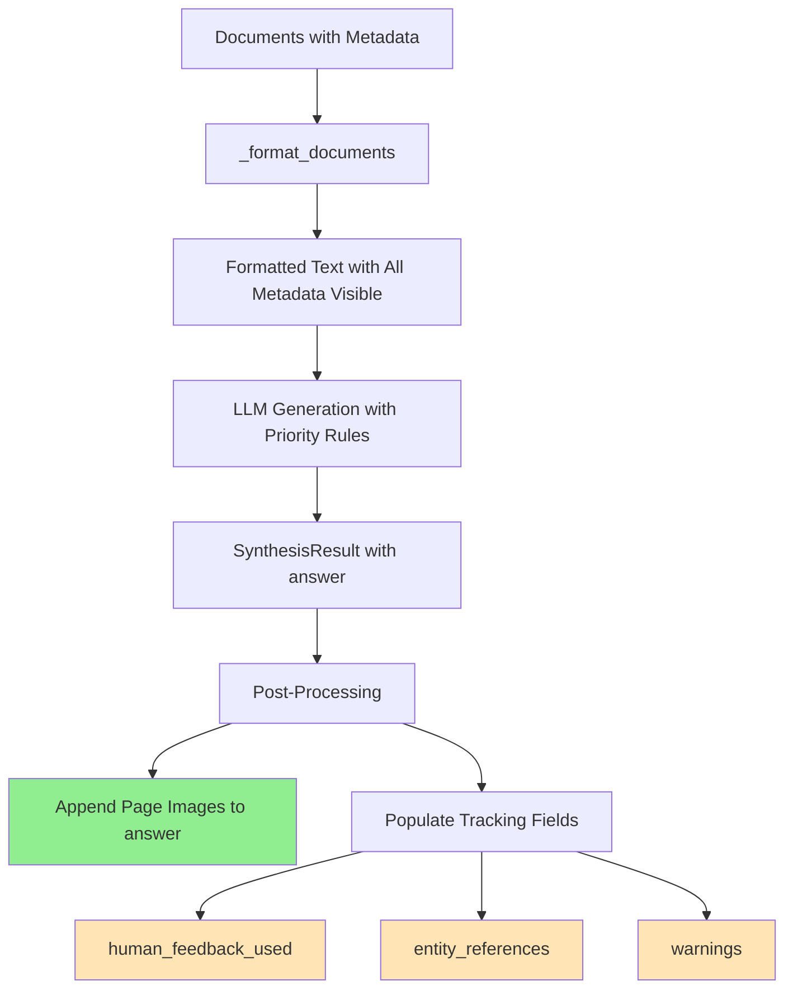

# Synthesis Answer Generation Process Analysis

## 🎯 Executive Summary

The synthesis node uses a **two-layer system** for incorporating extracted content:
1. **Answer Generation Layer**: LLM sees formatted documents with metadata and generates answers following priority rules
2. **Metadata Tracking Layer**: New schema fields track what information was available for verification

**Key Insight**: The new schema fields (`human_feedback_used`, `entity_references`, `warnings`) are for **tracking and verification**, not for direct answer generation.

## 📊 Complete Process Flow

### Stage 1: Document Preparation
```
Documents → _format_documents() → Formatted Text for LLM
```

Each document is transformed into structured text that includes:
- **Basic Info**: source, page, category
- **Content**: The actual document text
- **Caption**: If available
- **Entity Info**: Formatted by `_format_entity_info()`
- **Human Feedback**: Shown as "Human Verified: {text}"
- **Page Image Note**: Path to page image if available

### Stage 2: Document Formatting Details

#### Document Template Structure
```
[{idx}] Document Reference:
- Source: {source}
- Page: {page}
- Category: {category}
- Content: {content}
{caption}                  # If exists
{entity_info}              # If entity exists
{human_feedback}           # If human feedback exists
{page_image_note}          # If page image exists
---
Note: Use [{idx}] when citing this document in your answer.
```

#### Entity Formatting (`_format_entity_info`)

**For 똑딱이 (PPT Embedded Documents)**:
```
- **[SPECIAL] PPT Embedded Document (똑딱이)**:
  Title: {title}
  Details: {details}
  Keywords: {keywords}
  Can Answer: {hypothetical_questions}
```
*Plus special visual marker: `[📌 PPT 삽입 문서]`*

**For Tables**:
```
- Table: {title}
  Details: {details}
  Keywords: {keywords}
```

**For Figures**:
```
- Figure: {title}
  Description: {details}
```

#### Human Feedback Formatting
```
- Human Verified: {human_feedback_text}
```

### Stage 3: LLM Answer Generation

#### Priority Hierarchy (from Prompt)
```
1. HIGHEST PRIORITY - Human Verified Content
   ↓ (overrides all below)
2. HIGH PRIORITY - Structured Entity Data
   - PPT Embedded Documents (똑딱이)
   - Tables
   - Figures
   ↓ (overrides below)
3. STANDARD PRIORITY - Regular Document Content
```

#### LLM Instructions
The LLM is explicitly instructed to:
- **Line 78**: "When human feedback exists, prioritize it over other sources"
- **Line 79**: "When entity information exists, use the structured data to provide precise details"
- **Line 81-84**: Always mention when content is from 똑딱이 documents
- **Line 93**: "If there are conflicting information, human feedback takes precedence"

#### Structured Output Generation
```python
structured_llm = self.llm.with_structured_output(SynthesisResult)
result = structured_llm.invoke(
    self.synthesis_prompt.format_messages(
        query=query,
        documents=formatted_docs  # Contains all metadata
    )
)
```

The LLM generates:
- `answer`: Main answer text with citations
- `confidence`: Score 0.0-1.0
- `sources_used`: List of citations used
- `key_points`: Key information extracted
- `references_table`: Markdown table of sources

### Stage 4: Post-Processing

After LLM generation, additional processing occurs:

#### 1. Page Images Appending (Lines 529-553)
```python
if page_images:
    # Create PageImageInfo objects
    result.page_images = page_image_infos
    
    # APPEND to answer text
    image_section = "\n\n## 📎 참조 페이지 이미지\n..."
    result.answer = result.answer + image_section
```
**This MODIFIES the answer text by appending images**

#### 2. Metadata Collection (Lines 557-579)

**Human Feedback Tracking**:
```python
human_feedback = self._collect_human_feedback(documents)
if human_feedback:
    result.human_feedback_used = human_feedback  # Just tracking
```

**Entity References Tracking**:
```python
entity_refs = self._collect_entity_references(documents, doc_idx_map)
if entity_refs:
    result.entity_references = entity_refs  # Just tracking
```

**Warnings Extraction**:
```python
warnings = self._extract_warnings(documents)
if warnings:
    result.warnings = warnings  # Just tracking
```

**These DO NOT modify the answer text - they only populate tracking fields**

## 🔍 Critical Observations

### What DOES Influence Answer Content

1. **Document Formatting** (Stage 1-2)
   - All metadata is visible to LLM in formatted documents
   - Human feedback appears as "Human Verified" text
   - Entity details are fully expanded
   - Special markers for 똑딱이 documents

2. **Prompt Instructions** (Stage 3)
   - Priority hierarchy enforced through prompt
   - Specific instructions for handling each type of content
   - Conflict resolution rules (human feedback wins)

3. **Page Images** (Stage 4)
   - Actually appended to answer text post-generation

### What DOES NOT Directly Influence Answer Content

1. **Tracking Fields** (Stage 4)
   - `human_feedback_used`: Records what feedback was available
   - `entity_references`: Records what entities were referenced
   - `warnings`: Records extracted warnings
   
   These fields are for **verification and downstream processing**, not answer generation.

2. **Warnings Gap**
   - Warnings are extracted using `_extract_warnings()`
   - But they're NOT formatted into documents for LLM
   - They're only stored in `result.warnings` for tracking
   - **This means warnings might not appear in the answer unless they're in the original content**

## 📋 Process Summary



**Green**: Modifies answer text  
**Orange**: Only for tracking/verification

## 🎯 Key Takeaways

1. **Two-Layer System**:
   - **Generation Layer**: LLM sees everything through formatted documents
   - **Tracking Layer**: Schema fields record what was available

2. **Answer Content Sources**:
   - Primary: LLM processing of formatted documents with priority rules
   - Secondary: Page images appended post-generation
   - NOT from: The new tracking fields

3. **Purpose of New Fields**:
   - **Verification**: Confirm what information was available
   - **Quality Control**: Check if high-priority content was used
   - **Downstream Processing**: Other nodes can verify answer quality
   - **Debugging**: Track what metadata influenced the answer

4. **Potential Gap**:
   - Warnings are extracted but not explicitly fed to LLM
   - They rely on being present in original document content
   - Consider formatting warnings into documents if explicit inclusion needed

## 💡 Recommendations

1. **If you want warnings explicitly in answers**:
   - Add warning formatting to `_format_documents()`
   - Include warning section in document template
   - Add prompt instructions for handling warnings

2. **Current design is optimal for**:
   - Tracking what information was available
   - Verifying answer quality post-generation
   - Debugging why certain content was/wasn't included

3. **The tracking fields enable**:
   - Hallucination checking: Verify claims against available entities
   - Quality assessment: Check if human feedback was incorporated
   - Safety validation: Ensure warnings were captured