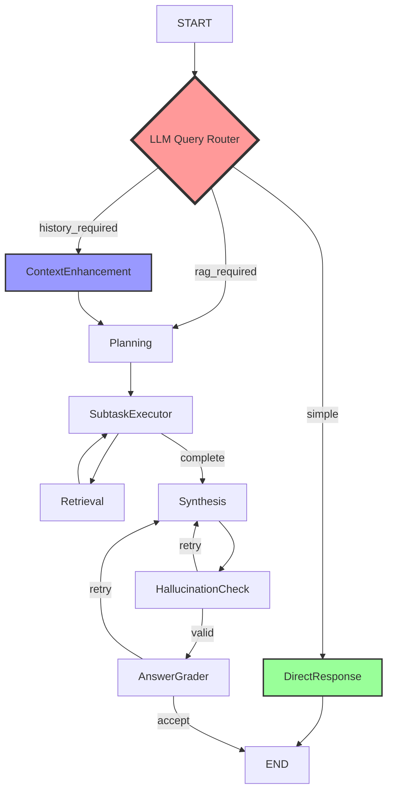

# 🚀 Multimodal RAG Workflow Enhancement Plan

> **작성일**: 2025-01-14
> **작성자**: Claude Code Assistant
> **버전**: 2.0.0
> **상태**: 계획 수정 완료 (단순화 및 최적화)

## 📋 목차

1. [개요](#개요)
2. [현황 분석](#현황-분석)
3. [요구사항 정리](#요구사항-정리)
4. [아키텍처 변경 계획](#아키텍처-변경-계획)
5. [구현 상세 계획](#구현-상세-계획)
6. [테스트 계획](#테스트-계획)
7. [작업 추적](#작업-추적)

---

## 개요

### 목적
100% RAG 의존적인 시스템을 LLM reasoning 기반 지능형 라우팅 시스템으로 업그레이드:
- LLM이 쿼리를 분석하여 적절한 처리 경로 결정
- 대화 히스토리 참조가 필요한 경우 자동 컨텍스트 보강
- Chat UI 스트리밍을 위한 메시지 기반 아키텍처

### 핵심 변경사항 (최소 필수만)
1. **Query Routing**: LLM reasoning으로 3가지 타입 분류 (simple/rag_required/history_required)
2. **Message-based State**: MessagesState 상속으로 스트리밍 지원
3. **Context Enhancement**: 히스토리 참조 쿼리의 자동 개선
4. **Domain Update**: Vehicle manual → Automobile manufacturing

---

## 현황 분석

### 현재 문제점

#### 1. RAG 의존성
- ❌ 모든 쿼리가 RAG 파이프라인 통과
- ❌ "안녕", "날씨" 같은 간단한 쿼리도 문서 검색 수행
- ❌ 불필요한 리소스 낭비 (토큰, API 호출, 시간)

#### 2. 대화 컨텍스트 부재
- ❌ 이전 대화 히스토리 활용 불가
- ❌ "아까 말한 내용"같은 참조 불가능
- ❌ 매 쿼리가 독립적으로 처리

#### 3. 도메인 제한
- ⚠️ 프롬프트가 "vehicle manual"로 하드코딩
- ⚠️ Automobile manufacturing 전반으로 확장 필요

#### 4. 스트리밍 미지원
- ❌ 중간 진행 상황 표시 불가
- ❌ Chat UI 통합 제한적

### 기술 스택
- **Framework**: LangGraph 0.2.x
- **LLM**: OpenAI GPT-4o-mini
- **Database**: PostgreSQL + pgvector
- **State Management**: MVPWorkflowState (61 fields)
- **Current Entry Point**: PlanningAgentNode

---

## 요구사항 정리

### 1. 쿼리 분류 체계 (LLM Reasoning 기반)
- **3가지 타입만**: simple / rag_required / history_required
- LLM이 쿼리와 대화 컨텍스트를 보고 reasoning하여 분류
- 단순 규칙이나 패턴 매칭 사용 안 함

### 2. Messages State 통합 (최소 변경)
- MessagesState 상속으로 messages 필드 자동 포함
- 각 노드에서 AIMessage 리스트 반환
- 기존 필드는 최대한 유지

### 3. 노드 구현 방향
- **QueryRouterNode**: LLM reasoning으로 쿼리 타입 판단
- **DirectResponseNode**: 단순 LLM 호출만 (템플릿 없음)
- **ContextEnhancementNode**: 히스토리 참조 해결

### 4. 유지보수 최적화
- 환경변수 추가 최소화 (기존 것 활용)
- State 필드 추가 최소화 (필수만)
- 코드 변경 최소화 (핵심만)

---

## 아키텍처 변경 계획

### 전체 워크플로우 구조



### 쿼리 타입별 처리 플로우

1. **simple (단순 쿼리)**
   - 인사, 일반 대화, 일반 지식 질문
   - Flow: QueryRouter → DirectResponse(LLM 호출) → END

2. **rag_required (RAG 필요)**
   - 자동차 제조 관련 기술 질문
   - Flow: QueryRouter → Planning → RAG Pipeline → END

3. **history_required (히스토리 참조)**
   - "아까 말한", "이전에 언급한" 등 참조 필요
   - Flow: QueryRouter → ContextEnhancement → Planning → RAG Pipeline → END
   - 처리: LLM이 대화 히스토리를 보고 참조 해결 → 자기완결적 쿼리 생성

### State 변경사항 (최소 필수만)

```python
from langgraph.graph import MessagesState
from typing import List, Dict, Optional, Annotated, Any
from langchain_core.documents import Document
from operator import add

class MVPWorkflowState(MessagesState):
    """MessagesState 상속으로 messages 필드 자동 포함"""
    
    # === 기존 필드들 모두 유지 (61개) ===
    query: str
    subtasks: List[Dict[str, Any]]
    current_subtask_idx: int
    documents: Annotated[List[Document], add]
    # ... (나머지 기존 필드들)
    
    # === 필수 추가 필드만 (3개) ===
    query_type: Optional[str] = None  # simple/rag_required/history_required
    enhanced_query: Optional[str] = None  # 컨텍스트 개선된 쿼리
    current_node: Optional[str] = None  # 디버깅용
```

---

## 구현 상세 계획

### Phase 1: State 및 기본 구조 변경

#### 1.1 State 클래스 수정 (`workflow/state.py`)

```python
from langgraph.graph import MessagesState
from langchain_core.messages import BaseMessage, AIMessage, HumanMessage

class MVPWorkflowState(MessagesState):
    """
    MessagesState를 상속하여 messages 필드 자동 포함
    Chat UI 스트리밍 지원
    """
    # 기존 필드들...
    
    # 새로운 필드
    query_type: Optional[str] = None
    requires_context: bool = False
    session_id: Optional[str] = None
    streaming_enabled: bool = True
    current_node: Optional[str] = None
```

#### 1.2 프롬프트 수정 (Vehicle Manual → Automobile Manufacturing)

**수정 대상 파일 및 위치**:

1. **planning_agent.py:56**
   ```python
   # 변경 전
   "You are a query planning expert for a RAG system about vehicle manuals"
   # 변경 후
   "You are a query planning expert for a RAG system about automobile manufacturing documents including manuals, technical specifications, reports, and industry documentation"
   ```

2. **synthesis.py:49**
   ```python
   # 변경 전
   "You are an expert assistant for a vehicle manual RAG system"
   # 변경 후
   "You are an expert assistant for an automobile manufacturing RAG system handling diverse technical documents"
   ```

3. **answer_grader.py:56**
   ```python
   # 변경 전
   "You are a quality evaluator for a RAG system specializing in vehicle manuals"
   # 변경 후
   "You are a quality evaluator for a RAG system specializing in automobile manufacturing documentation"
   ```

4. **subtask_executor.py:131, 157, 179**
   - 모든 "vehicle manual" → "automobile manufacturing documents"

### Phase 2: Query Router Node 구현 (LLM Reasoning)

#### 2.1 Query Router Node (`workflow/nodes/query_router.py`)

```python
from langchain_core.messages import AIMessage, HumanMessage
from langchain_openai import ChatOpenAI
from pydantic import BaseModel, Field
from typing import Literal, Dict, Any, List, Optional
import logging
import os

logger = logging.getLogger(__name__)

class QueryClassification(BaseModel):
    """LLM이 추론한 쿼리 분류 결과"""
    type: Literal[
        "simple",              # RAG 불필요, LLM 직접 답변 가능
        "rag_required",        # 자동차 제조 문서 검색 필요
        "history_required"     # 이전 대화 참조 필요
    ]
    reasoning: str  # LLM의 추론 과정
    confidence: float = Field(ge=0.0, le=1.0)

class QueryRouterNode:
    """LLM reasoning으로 쿼리를 분류하고 라우팅하는 노드"""
    
    def __init__(self):
        self.llm = ChatOpenAI(
            model=os.getenv("OPENAI_MODEL", "gpt-4o-mini"),
            temperature=0
        )
        
        self.classification_prompt = ChatPromptTemplate.from_messages([
            ("system", """You are an intelligent query classifier using reasoning, not pattern matching.

Analyze the query and recent conversation to determine the type:

1. **simple**: Query that can be answered with general knowledge without searching documents
   - Greetings, casual chat, general knowledge questions
   - Questions unrelated to automobile manufacturing
   
2. **rag_required**: Query that needs to search automobile manufacturing documents
   - Technical specifications, manufacturing processes
   - Quality standards, safety procedures
   - Any domain-specific information
   
3. **history_required**: Query that references previous conversation
   - Contains references like "이전에", "아까", "위에서", "that", "it", etc.
   - Needs context from earlier messages to be fully understood
   - After resolving references, might still need RAG

Use reasoning to decide, not keyword matching. Consider:
- Does this require domain-specific knowledge from documents?
- Are there unresolved references to previous conversation?
- Can I answer this with general knowledge alone?

Provide your reasoning process in the 'reasoning' field."""),
            ("human", """Query: {query}

Recent messages (for context):
{recent_messages}

Classify this query.""")
        ])
    
    async def __call__(self, state: MVPWorkflowState) -> Dict[str, Any]:
        """노드 실행"""
        logger.info(f"[QUERY_ROUTER] Node started")
        
        try:
            query = state["query"]
            messages = state.get("messages", [])
            
            # 진행 상황 메시지
            progress_messages = [
                AIMessage(content="🔍 쿼리를 분석하고 있습니다...")
            ]
            
            # 최근 메시지 컨텍스트 준비 (최대 5개)
            recent_messages = []
            for msg in messages[-10:]:  # 최근 10개에서
                if isinstance(msg, (HumanMessage, AIMessage)):
                    recent_messages.append(f"{msg.__class__.__name__}: {msg.content[:100]}")
            recent_context = "\n".join(recent_messages) if recent_messages else "No previous messages"
            
            # LLM으로 분류
            structured_llm = self.llm.with_structured_output(QueryClassification)
            classification = await structured_llm.ainvoke(
                self.classification_prompt.format_messages(
                    query=query,
                    recent_messages=recent_context
                )
            )
            
            logger.info(f"[QUERY_ROUTER] Classification: {classification.type} (confidence: {classification.confidence:.2f})")
            
            # 완료 메시지
            type_emoji = {
                "greeting": "👋",
                "chitchat": "💬",
                "weather": "🌤️",
                "follow_up": "🔄",
                "automobile_manufacturing": "🏭"
            }
            
            progress_messages.append(
                AIMessage(content=f"{type_emoji.get(classification.type, '❓')} 쿼리 타입: {classification.type}")
            )
            
            # State 업데이트
            result = {
                "messages": progress_messages,
                "query_type": classification.type,
                "requires_context": classification.requires_context,
                "current_node": "query_router",
                "metadata": {
                    **state.get("metadata", {}),
                    "query_classification": {
                        "type": classification.type,
                        "confidence": classification.confidence,
                        "reasoning": classification.reasoning,
                        "suggested_response": classification.suggested_response
                    }
                }
            }
            
            logger.info(f"[QUERY_ROUTER] Node completed successfully")
            return result
            
        except Exception as e:
            logger.error(f"[QUERY_ROUTER] Failed: {str(e)}")
            return {
                "messages": [
                    AIMessage(content=f"❌ 쿼리 분류 실패: {str(e)}")
                ],
                "error": str(e),
                "query_type": "automobile_manufacturing"  # 기본값
            }
    
    def invoke(self, state: MVPWorkflowState) -> Dict[str, Any]:
        """동기 실행 (LangGraph 호환)"""
        import asyncio
        return asyncio.run(self.__call__(state))
```

### Phase 3: Direct Response Node 구현 (단순 LLM 호출)

#### 3.1 Direct Response Node (`workflow/nodes/direct_response.py`)

```python
class DirectResponseNode:
    """단순 쿼리에 대해 LLM이 직접 응답하는 노드"""
    
    def __init__(self):
        self.llm = ChatOpenAI(
            model=os.getenv("OPENAI_MODEL", "gpt-4o-mini"),
            temperature=0.7  # 자연스러운 대화를 위해 약간 높임
        )
        
        self.response_prompt = ChatPromptTemplate.from_messages([
            ("system", """You are a helpful AI assistant. 
            Answer the user's query directly and naturally.
            If asked about automobile manufacturing, mention that you can help with technical questions if they search the documentation.
            Keep responses concise and friendly."""),
            ("human", "{query}")
        ])
    
    async def __call__(self, state: MVPWorkflowState) -> Dict[str, Any]:
        """노드 실행 - 단순 LLM 호출"""
        logger.info(f"[DIRECT_RESPONSE] Node started")
        
        query = state.get("query", "")
        
        messages = [
            AIMessage(content="💬 응답을 생성하고 있습니다...")
        ]
        
        # LLM 호출하여 응답 생성
        response = await self.llm.ainvoke(
            self.response_prompt.format_messages(query=query)
        )
        
        messages.append(
            AIMessage(content=response.content)
        )
        
        logger.info(f"[DIRECT_RESPONSE] Generated response")
        
        return {
            "messages": messages,
            "final_answer": response.content,
            "workflow_status": "completed",
            "current_node": "direct_response"
        }
    
    def invoke(self, state: MVPWorkflowState) -> Dict[str, Any]:
        """동기 실행"""
        import asyncio
        return asyncio.run(self.__call__(state))
```

### Phase 4: Context Enhancement Node 구현 (LLM 기반)

#### 4.1 Context Enhancement Node (`workflow/nodes/context_enhancement.py`)

```python
class ContextEnhancementNode:
    """LLM이 대화 히스토리를 보고 참조를 해결하는 노드"""
    
    def __init__(self):
        self.llm = ChatOpenAI(
            model=os.getenv("OPENAI_MODEL", "gpt-4o-mini"),
            temperature=0
        )
        
        self.enhancement_prompt = ChatPromptTemplate.from_messages([
            ("system", """You are analyzing a follow-up query that references previous conversation.

Your task: Create a self-contained query by resolving references using conversation history.

Process:
1. Identify what the user is referring to (이전에, 아까, that, it, etc.)
2. Find the relevant context from previous messages
3. Create a complete query that doesn't need context to understand
4. Preserve the original intent and question

Important:
- Only add necessary context, don't over-elaborate
- Keep technical terms accurate
- The enhanced query should be searchable in documents

Example:
- History: "GV80 엔진의 조립 공정을 알려줘"
- Follow-up: "거기에 필요한 도구는?"
- Enhanced: "GV80 엔진 조립 공정에 필요한 도구"
"""),
            ("human", """Original query: {query}

Recent conversation:
{conversation_history}

Enhance this follow-up query with necessary context:""")
        ])
    
    async def __call__(self, state: MVPWorkflowState) -> Dict[str, Any]:
        """노드 실행"""
        logger.info(f"[CONTEXT_ENHANCEMENT] Node started")
        
        try:
            query = state["query"]
            messages = state.get("messages", [])
            
            progress_messages = [
                AIMessage(content="🔄 이전 대화 컨텍스트를 분석하고 있습니다...")
            ]
            
            # 대화 히스토리 준비
            conversation_history = []
            for msg in messages[-10:]:  # 최근 10개 메시지
                if isinstance(msg, HumanMessage):
                    conversation_history.append(f"User: {msg.content}")
                elif isinstance(msg, AIMessage) and not msg.content.startswith("🔄"):
                    # 진행 상황 메시지 제외
                    conversation_history.append(f"Assistant: {msg.content[:200]}")
            
            history_text = "\n".join(conversation_history) if conversation_history else "No previous conversation"
            
            # 쿼리 개선
            response = await self.llm.ainvoke(
                self.enhancement_prompt.format_messages(
                    query=query,
                    conversation_history=history_text
                )
            )
            
            enhanced_query = response.content
            logger.info(f"[CONTEXT_ENHANCEMENT] Enhanced: '{query}' → '{enhanced_query}'")
            
            progress_messages.append(
                AIMessage(content=f"✅ 컨텍스트 적용 완료: {enhanced_query}")
            )
            
            return {
                "messages": progress_messages,
                "query": enhanced_query,  # 원본 쿼리를 개선된 쿼리로 교체
                "current_node": "context_enhancement",
                "metadata": {
                    **state.get("metadata", {}),
                    "context_enhancement": {
                        "original_query": query,
                        "enhanced_query": enhanced_query,
                        "history_used": len(conversation_history)
                    }
                }
            }
            
        except Exception as e:
            logger.error(f"[CONTEXT_ENHANCEMENT] Failed: {str(e)}")
            return {
                "messages": [
                    AIMessage(content=f"⚠️ 컨텍스트 개선 실패, 원본 쿼리 사용: {query}")
                ],
                "current_node": "context_enhancement"
            }
    
    def invoke(self, state: MVPWorkflowState) -> Dict[str, Any]:
        """동기 실행"""
        import asyncio
        return asyncio.run(self.__call__(state))
```

### Phase 5: 기존 노드들의 Messages 지원 추가

#### 5.1 각 노드에 스트리밍 메시지 추가

**PlanningAgentNode 수정 예시**:
```python
async def __call__(self, state: MVPWorkflowState) -> Dict[str, Any]:
    logger.info(f"[PLANNING] Node started")
    
    # 스트리밍 메시지 추가
    messages = [
        AIMessage(content="🔄 쿼리를 분석하여 작업 계획을 수립하고 있습니다...")
    ]
    
    try:
        query = state["query"]
        # ... 기존 로직 ...
        
        # 서브태스크 생성 후
        messages.append(
            AIMessage(content=f"📋 {len(subtasks)}개의 서브태스크로 분해 완료")
        )
        
        # 서브태스크 상세 정보
        task_list = "\n".join([
            f"  {i+1}. {task['query'][:50]}..." 
            for i, task in enumerate(subtasks)
        ])
        messages.append(
            AIMessage(content=f"📝 작업 계획:\n{task_list}")
        )
        
        result = {
            "messages": messages,  # 메시지 추가
            "subtasks": subtasks,
            "current_subtask_idx": 0,
            "metadata": metadata,
            "workflow_status": "running",
            "current_node": "planning"
        }
        
        return result
    except Exception as e:
        # ... 에러 처리 ...
```

**모든 노드에 동일한 패턴 적용**:
1. SubtaskExecutorNode
2. RetrievalNode
3. SynthesisNode
4. HallucinationCheckNode
5. AnswerGraderNode

### Phase 6: Graph 재구성 (최소 변경)

#### 6.1 Graph 수정 (`workflow/graph.py`)

```python
from workflow.nodes.query_router import QueryRouterNode
from workflow.nodes.direct_response import DirectResponseNode
from workflow.nodes.context_enhancement import ContextEnhancementNode

class MVPWorkflowGraph:
    def __init__(self, checkpointer_path: Optional[str] = None):
        # 기존 노드들 유지...
        
        # Query Routing 활성화 체크
        self.enable_routing = os.getenv("ENABLE_QUERY_ROUTING", "true").lower() == "true"
        
        if self.enable_routing:
            # 새로운 노드 추가
            self.query_router = QueryRouterNode()
            self.direct_response = DirectResponseNode()
            self.context_enhancement = ContextEnhancementNode()
        
        # 기존 checkpointer 로직 유지
        if checkpointer_path:
            self.checkpointer = SqliteSaver.from_conn_string(checkpointer_path)
        else:
            self.checkpointer = None
        
        # 그래프 구성
        self.graph = self._build_graph()
        
        # 기존 recursion limit 로직 유지
        max_subtasks = int(os.getenv("LANGGRAPH_PLANNING_MAX_SUBTASKS", "5"))
        max_retries = int(os.getenv("CRAG_MAX_RETRIES", "3"))
        recursion_limit = (max_subtasks * 3) + (max_retries * 4) + 10
        
        if self.enable_routing:
            recursion_limit += 5  # 라우팅 노드들 고려
        
        self.app = self.graph.compile(
            checkpointer=self.checkpointer
        ).with_config(recursion_limit=recursion_limit)
    
    def _build_graph(self) -> StateGraph:
        """워크플로우 그래프 구성"""
        workflow = StateGraph(MVPWorkflowState)
        
        if self.enable_routing:
            # === 라우팅 활성화 시 ===
            # 새로운 노드들
            workflow.add_node("query_router", self.query_router.invoke)
            workflow.add_node("direct_response", self.direct_response.invoke)
            workflow.add_node("context_enhancement", self.context_enhancement.invoke)
            
            # 엔트리 포인트를 query_router로
            workflow.set_entry_point("query_router")
            
            # 조건부 라우팅
            def route_query(state: MVPWorkflowState) -> str:
                """쿼리 타입에 따른 라우팅"""
                query_type = state.get("query_type", "rag_required")
                
                if query_type == "simple":
                    return "direct_response"
                elif query_type == "history_required":
                    return "context_enhancement"
                else:  # rag_required
                    return "planning"
            
            workflow.add_conditional_edges(
                "query_router",
                route_query,
                {
                    "direct_response": "direct_response",
                    "context_enhancement": "context_enhancement",
                    "planning": "planning"
                }
            )
            
            # Direct Response는 바로 종료
            workflow.add_edge("direct_response", END)
            
            # Context Enhancement는 Planning으로 (enhanced_query 사용)
            workflow.add_edge("context_enhancement", "planning")
        else:
            # === 라우팅 비활성화 시 (기존 동작) ===
            workflow.set_entry_point("planning")
        
        # === 기존 노드들 (공통) ===
        workflow.add_node("planning", self.planning_node.invoke)
        workflow.add_node("subtask_executor", self.subtask_executor.invoke)
        workflow.add_node("retrieval", self.retrieval_node.invoke)
        workflow.add_node("synthesis", self.synthesis_node.invoke)
        workflow.add_node("hallucination_check", self.hallucination_check.invoke)
        workflow.add_node("answer_grader", self.answer_grader.invoke)
        
        if self.use_tavily:
            workflow.add_node("web_search", self._web_search_node_sync)
        
        # 기존 엣지들 유지
        workflow.add_edge("planning", "subtask_executor")
        # ... (나머지 기존 엣지 구조)
        
        return workflow
```

### Phase 7: 환경변수 (최소 추가)

#### 7.1 .env 파일 업데이트

```bash
# === 기존 환경변수 활용 ===
# OPENAI_MODEL=gpt-4o-mini  (이미 있음)
# OPENAI_API_KEY=sk-...     (이미 있음)

# === 필수 추가만 ===
ENABLE_QUERY_ROUTING=true  # Query routing 기능 on/off (기본값: true)
```

기존 환경변수들을 최대한 활용:
- `OPENAI_MODEL`: 모든 LLM 노드에서 공통 사용
- `OPENAI_API_KEY`: 이미 설정되어 있음
- `LANGGRAPH_PLANNING_MAX_SUBTASKS`: 이미 있음
- `CRAG_MAX_RETRIES`: 이미 있음

---

## 테스트 계획 (핵심만)

### 기능 테스트

1. **3가지 쿼리 타입 테스트**
   ```python
   test_queries = [
       "안녕하세요",  # simple → DirectResponse
       "엔진 조립 공정을 알려줘",  # rag_required → Full RAG
       "아까 말한 공정의 품질 기준은?",  # history_required → Context + RAG
   ]
   ```

2. **LLM Reasoning 검증**
   - Query Router가 LLM reasoning으로 올바르게 분류하는지
   - Context Enhancement가 참조를 제대로 해결하는지

3. **메시지 스트리밍 확인**
   - 각 노드가 AIMessage 반환하는지
   - 스트리밍이 작동하는지

---

## 작업 추적

### 구현 체크리스트 (우선순위별)

#### Phase 1: 핵심 기반 작업
- [ ] State에 MessagesState 상속 + 3개 필드 추가
- [ ] 프롬프트 수정 (vehicle manual → automobile manufacturing)
  - [ ] planning_agent.py
  - [ ] synthesis.py  
  - [ ] answer_grader.py
  - [ ] subtask_executor.py

#### Phase 2: Query Routing 구현
- [ ] QueryRouterNode 구현 (LLM reasoning)
- [ ] DirectResponseNode 구현 (단순 LLM 호출)
- [ ] ContextEnhancementNode 구현 (히스토리 참조 해결)

#### Phase 3: 기존 노드 메시지 지원 (간단)
- [ ] 각 노드에 messages 반환 1-2줄 추가
  - [ ] PlanningAgentNode
  - [ ] SubtaskExecutorNode
  - [ ] RetrievalNode
  - [ ] SynthesisNode
  - [ ] HallucinationCheckNode
  - [ ] AnswerGraderNode

#### Phase 4: Graph 재구성
- [ ] _build_graph() 메서드 수정
- [ ] 조건부 라우팅 추가
- [ ] ENABLE_QUERY_ROUTING 플래그 처리

#### Phase 5: 테스트
- [ ] 3가지 쿼리 타입 테스트
- [ ] 스트리밍 동작 확인

### 진행 상황 기록

| 날짜 | 작업 내용 | 상태 | 담당자 | 비고 |
|------|----------|------|--------|------|
| 2025-01-14 | 계획 수립 완료 | ✅ | Claude | 초기 계획 |
| | | | | |
| | | | | |

### 이슈 및 리스크

1. **최소 리스크 접근**
   - MessagesState 상속은 기존 필드에 영향 없음 (messages 필드만 추가)
   - ENABLE_QUERY_ROUTING 플래그로 기능 on/off 가능
   - 기존 동작 완전 보존 (라우팅 비활성화 시)

2. **LLM 의존성**
   - Query Router와 Context Enhancement가 LLM 호출 추가
   - 레이턴시 약간 증가 예상 (simple 쿼리는 오히려 빨라짐)

3. **테스트 전략**
   - 라우팅 비활성화 상태로 먼저 배포
   - 충분한 테스트 후 활성화

---

## 참고 자료

### 내부 문서
- `/LANGGRAPH_CHAT_UI_STREAMING_GUIDE.md` - 스트리밍 가이드
- `/CLAUDE.md` - 프로젝트 규칙 및 컨텍스트
- `/workflow/state.py` - 현재 State 정의

### 외부 참조
- [LangGraph Documentation](https://langchain-ai.github.io/langgraph/)
- [LangGraph Adaptive RAG](https://github.com/langchain-ai/langgraph/examples/rag)
- [Chat UI Repository](https://github.com/langchain-ai/agent-chat-ui)

---

## 핵심 변경 요약

### 단순화된 아키텍처
1. **3가지 쿼리 타입만**: simple / rag_required / history_required
2. **LLM Reasoning 기반**: 모든 판단을 LLM이 수행 (패턴 매칭 X)
3. **최소 코드 변경**: 기존 시스템 유지하며 점진적 개선
4. **단일 플래그 제어**: ENABLE_QUERY_ROUTING으로 전체 기능 on/off

### 주요 장점
- **유지보수 용이**: 코드 변경 최소화, 환경변수 단순
- **점진적 적용**: 기존 동작 보존하며 새 기능 추가
- **성능 개선**: simple 쿼리는 RAG 파이프라인 건너뛰어 빠른 응답
- **확장 가능**: 향후 더 복잡한 라우팅 로직 추가 가능

## 다음 단계

1. **Phase 1 시작**: State 수정과 프롬프트 업데이트
2. **Phase 2 구현**: 3개 새 노드 구현
3. **테스트 후 배포**: 라우팅 비활성화 상태로 먼저 배포

---

*문서 버전: 2.0.0 (단순화 및 최적화 완료)*
*작성일: 2025-01-14*