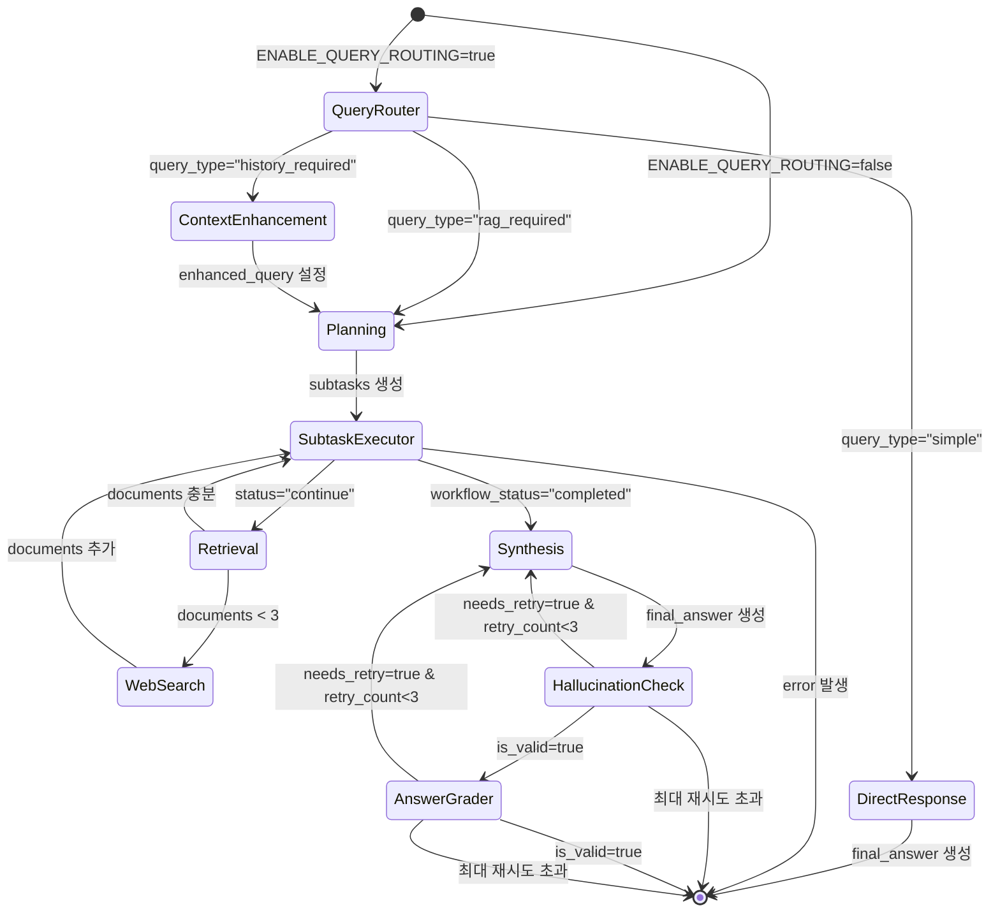

# 워크플로우 State 전이 상세 분석

작성일: 2025-01-18

## State 전이 플로우 다이어그램



## 노드별 State 변경 사항

### 1. QueryRouterNode
**입력 State 필드**:
- `query`: 사용자 쿼리
- `messages`: 대화 히스토리

**출력 State 변경**:
- `query_type`: "simple" | "rag_required" | "history_required"
- `current_node`: "query_router"
- `messages`: AIMessage 추가 (스트리밍용)

### 2. DirectResponseNode
**입력 State 필드**:
- `query`: 사용자 쿼리
- `messages`: 대화 히스토리

**출력 State 변경**:
- `final_answer`: LLM 생성 답변
- `workflow_status`: "completed"
- `current_node`: "direct_response"
- `messages`: AIMessage 추가

### 3. ContextEnhancementNode
**입력 State 필드**:
- `query`: 원본 쿼리
- `messages`: 대화 히스토리

**출력 State 변경**:
- `enhanced_query`: 컨텍스트가 해결된 쿼리
- `current_node`: "context_enhancement"
- `messages`: AIMessage 추가

### 4. PlanningAgentNode
**입력 State 필드**:
- `query`: 사용자 쿼리 (또는 enhanced_query)

**출력 State 변경**:
- `subtasks`: List[SubtaskState] 생성
  - id, query, priority, dependencies, status
- `current_subtask_idx`: 0으로 초기화
- `metadata`: 실행 계획 정보 추가
- `current_node`: "planning"
- `messages`: AIMessage 추가

### 5. SubtaskExecutorNode
**입력 State 필드**:
- `subtasks`: 서브태스크 목록
- `current_subtask_idx`: 현재 인덱스

**출력 State 변경**:
- `query_variations`: 3-5개 쿼리 변형 생성
- `search_filter`: 동적 필터 생성
  - source, categories, page_range, entity
- `subtasks[idx].status`: "executing" → "retrieved"
- `current_subtask_idx`: +1 증가 (다음 서브태스크)
- `workflow_status`: 모든 태스크 완료 시 "completed"

### 6. RetrievalNode
**입력 State 필드**:
- `query_variations`: Multi-Query 목록
- `search_filter`: 검색 필터
- `subtasks`: 현재 서브태스크 정보

**출력 State 변경**:
- `documents`: 검색된 문서 추가 (누적)
- `metadata`: 검색 통계 추가
  - search_count, language_detected, confidence
- `subtask_results`: 검색 결과 추가
- `confidence_score`: 검색 신뢰도 업데이트

### 7. WebSearchNode (Tavily)
**입력 State 필드**:
- `query`: 검색 쿼리
- `documents`: 기존 문서

**출력 State 변경**:
- `documents`: 웹 검색 결과 추가
- `error`: None으로 클리어
- `errors`: [] 빈 리스트로 초기화
- `warnings`: [] 빈 리스트로 초기화
- `metadata.web_search_performed`: true
- `workflow_status`: "continuing"

### 8. SynthesisNode
**입력 State 필드**:
- `documents`: 검색된 모든 문서
- `query`: 원본 쿼리
- `retry_count`: 재시도 횟수

**출력 State 변경**:
- `final_answer`: 구조화된 답변 생성
- `retry_count`: +1 증가 (재시도 시)
- `confidence_score`: 답변 신뢰도
- `metadata.synthesis_time`: 실행 시간
- `current_node`: "synthesis"
- `messages`: AIMessage 추가

### 9. HallucinationCheckNode
**입력 State 필드**:
- `final_answer`: 생성된 답변
- `documents`: 근거 문서들

**출력 State 변경**:
- `hallucination_check`: QualityCheckResult
  - is_valid, score, reason, suggestions, needs_retry
- `should_retry`: 재시도 필요 여부
- `current_node`: "hallucination_check"
- `messages`: AIMessage 추가

### 10. AnswerGraderNode
**입력 State 필드**:
- `final_answer`: 검증된 답변
- `query`: 원본 쿼리

**출력 State 변경**:
- `answer_grade`: QualityCheckResult
  - is_valid, score, reason, suggestions, needs_retry
- `workflow_status`: "completed" | "needs_retry"
- `confidence_score`: 최종 신뢰도
- `current_node`: "answer_grader"
- `messages`: AIMessage 추가

## 조건부 엣지 로직

### 1. _should_continue_subtasks()
```python
if state.get("error"):
    return "failed"
if state.get("workflow_status") == "completed":
    return "complete"
if current_idx >= len(subtasks):
    return "complete"
if subtasks[current_idx]["status"] == "retrieved":
    return "continue"
return "continue"
```

### 2. _should_web_search()
```python
if not self.use_tavily:
    return "continue"
if len(documents) < 3:
    return "search"
if metadata.get("require_web_search"):
    return "search"
return "continue"
```

### 3. _check_hallucination()
```python
if state.get("error"):
    return "failed"
if hallucination_check.get("is_valid"):
    return "valid"
if needs_retry and retry_count < max_retries:
    return "retry"
return "failed"
```

### 4. _check_answer_quality()
```python
if state.get("error"):
    return "failed"
if answer_grade.get("is_valid"):
    return "accept"
if needs_retry and retry_count < max_retries:
    return "retry"
return "failed"
```

## State 필드 누적 vs 대체

### 누적 필드 (Annotated[List, add])
- `documents`: 모든 검색 결과 누적
- `subtask_results`: 서브태스크별 결과 누적
- `warnings`: 경고 메시지 누적
- `messages`: 대화 메시지 누적

### 대체 필드
- `query_variations`: 각 서브태스크마다 새로 생성
- `search_filter`: 각 서브태스크마다 새로 생성
- `final_answer`: Synthesis 재시도 시 덮어쓰기
- `retry_count`: 증가만 (대체 아님)
- `current_subtask_idx`: 증가만
- `workflow_status`: 상태 전이

## 중요한 State 불변성 규칙

1. **messages는 항상 추가만**: 대화 히스토리 보존
2. **documents는 중복 제거하며 누적**: ID 기반 중복 체크
3. **error 클리어는 명시적으로**: WebSearch 성공 시에만
4. **retry_count는 Synthesis에서만 증가**: 재시도 제어
5. **workflow_status는 terminal 상태 주의**: completed/failed는 되돌릴 수 없음

## State 초기화 값

```python
initial_state = {
    "query": query,
    "workflow_status": "started",
    "metadata": {},
    "retry_count": 0,
    "documents": [],
    "execution_time": {},
    "current_subtask_idx": 0,
    "subtasks": [],
    "messages": [],  # MessagesState 상속
    "warnings": [],
    "subtask_results": [],
    "confidence_score": 0.0,
    "should_use_web": False,
    "should_retry": False,
    "max_iterations": 3,
    "iteration_count": 0,
    "search_language": "korean",
}
```