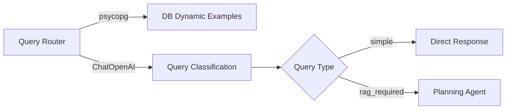
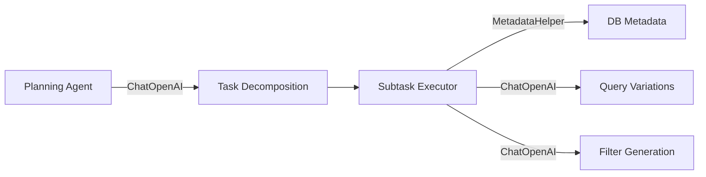
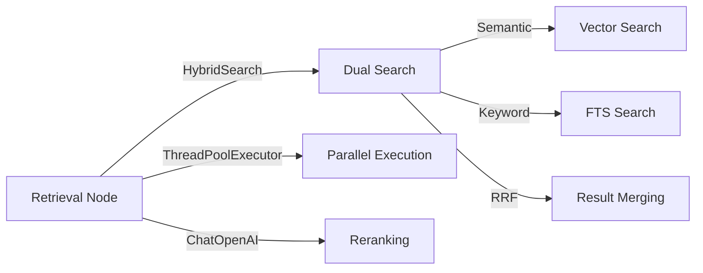
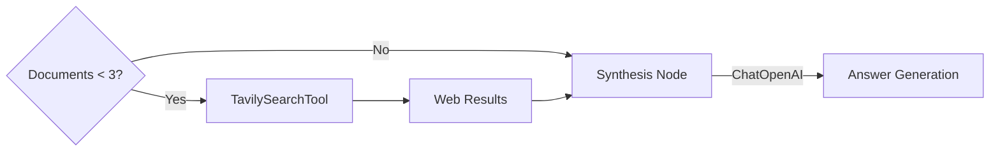

# Workflow Tools Deep Analysis
*Generated: 2025-01-09*

## 📦 Tool Architecture Overview

### Tool Categories

#### 1. **Explicit Tools** (workflow/tools/)
- **TavilySearchTool**: External web search fallback
  - Location: `workflow/tools/tavily_search.py`
  - Purpose: Supplement local retrieval when documents insufficient
  - Activation: When retrieved documents < 3

#### 2. **Embedded Tools** (Within Nodes)
Tools integrated directly into workflow nodes:

| Tool | Location | Purpose |
|------|----------|---------|
| HybridSearch | retrieval/hybrid_search.py | Dual-language semantic + keyword search |
| DatabaseManager | ingest/database.py | PostgreSQL connection pooling |
| MVPSearchFilter | retrieval/search_filter.py | Dynamic query filtering |
| MetadataHelper | workflow/nodes/subtask_executor.py | DB metadata access |
| ChatOpenAI | All nodes | LLM reasoning and generation |

#### 3. **Infrastructure Tools**
- **ThreadPoolExecutor**: Parallel search execution (retrieval node)
- **psycopg ConnectionPool**: Database connection management
- **asyncio Utilities**: Async-to-sync conversion wrappers

## 🔄 Tool Usage Flow Through Workflow

### Phase 1: Query Processing


**Tools Used:**
- **psycopg**: Direct DB access for real-time examples
- **ChatOpenAI**: LLM classification with structured output
- **MetadataHelper**: DB metadata for direct response

### Phase 2: Task Planning & Execution


**Tools Used:**
- **ChatOpenAI with structured output**: 
  - ExecutionPlan schema for task decomposition
  - QueryVariations schema for multi-query
  - DDUFilterGeneration schema for filters
- **MetadataHelper**: Real DB categories, entity types, sources

### Phase 3: Document Retrieval


**Tools Used:**
- **HybridSearch**: Core search orchestrator
  - Semantic search with embeddings
  - Keyword search with Kiwi/spaCy
  - RRF merging (k=60)
- **MVPSearchFilter**: Apply metadata filters
- **DatabaseManager**: Connection pool management
- **ThreadPoolExecutor**: 3 workers for parallel search
- **ChatOpenAI**: Language detection & document reranking

### Phase 4: Fallback & Synthesis


**Tools Used:**
- **TavilySearchTool**: Web search with max 5 results
- **ChatOpenAI**: Answer synthesis with 6000 token limit

## 🛠️ Tool Implementation Details

### TavilySearchTool
```python
class TavilySearchTool:
    def __init__(self, max_results: int = 5):
        self.client = TavilyClient(api_key)
        self.executor = ThreadPoolExecutor(max_workers=1)
    
    def _search_sync(query, search_depth="basic"):
        # Synchronous search execution
        return self.client.search(query, search_depth, max_results)
    
    def search_sync(query) -> List[Document]:
        # Convert results to LangChain Documents
        # Add metadata: source, title, score, rank
```

**Features:**
- Sync/Async dual support
- Graceful error handling (returns empty on failure)
- Document conversion with rich metadata
- Advanced search with domain filtering

### HybridSearch
```python
class HybridSearch:
    def __init__(self, db_manager):
        self.semantic_weight = 0.5
        self.keyword_weight = 0.5
        self.rrf_k = 60
    
    def _execute_with_retry(query, params, max_retries=3):
        # Retry logic for DB resilience
        # Exponential backoff: 1s, 2s, 4s
    
    def search(queries, filter, top_k):
        # Parallel semantic + keyword search
        # RRF merging of results
```

**Features:**
- Connection pool resilience
- Retry with exponential backoff
- Parallel search execution
- Configurable weights

### MetadataHelper
```python
class MetadataHelper:
    def get_metadata() -> Dict:
        # Direct DB query for:
        # - Available categories
        # - Entity types
        # - Source documents
        # - Page ranges
```

**Features:**
- Connection string validation
- Caching (300s TTL)
- Minimal metadata approach
- Error recovery

## 🔧 Tool Orchestration Patterns

### 1. Sequential Chaining
```
Query → Router → Planning → Subtask → Retrieval → Synthesis → CRAG
```
Each tool's output feeds the next tool's input.

### 2. Parallel Execution
```python
# In RetrievalNode
with ThreadPoolExecutor(max_workers=3) as executor:
    futures = []
    for query_variant in query_variations:
        future = executor.submit(search_task, query_variant)
        futures.append(future)
```

### 3. Conditional Activation
```python
# Web search only when needed
if len(documents) < 3:
    return "search"  # Trigger TavilySearchTool
else:
    return "continue"
```

### 4. Tool Composition
```python
# HybridSearch combines multiple tools
results = []
results.extend(self._semantic_search(query))
results.extend(self._keyword_search(query))
merged = self._rrf_merge(results)
```

## ⚠️ Error Handling Strategies

### 1. Retry with Backoff
```python
# HybridSearch._execute_with_retry
for attempt in range(max_retries):
    try:
        return operation()
    except (OperationalError, InterfaceError):
        if attempt < max_retries - 1:
            sleep(backoff_time)
            backoff_time *= 2
```

### 2. Graceful Degradation
```python
# TavilySearchTool
try:
    response = self.client.search(query)
except Exception as e:
    return {"results": [], "error": str(e)}
```

### 3. State Error Tracking
```python
# In workflow nodes
try:
    result = tool.execute()
except Exception as e:
    return {
        "error": str(e),
        "warnings": [f"Tool failed: {tool_name}"]
    }
```

### 4. Fallback Mechanisms
```python
# Query Router fallback
try:
    examples = self._load_dynamic_examples()
except:
    examples = self.default_examples
```

## 📊 Tool Performance Metrics

### Execution Times
| Tool | Average Time | Max Concurrent |
|------|-------------|----------------|
| HybridSearch | ~378ms | 3 parallel |
| TavilySearch | ~2-3s | 1 (external API) |
| ChatOpenAI | ~1-2s | Sequential |
| MetadataHelper | <50ms (cached) | N/A |

### Resource Usage
- **DB Connections**: Pool of 5-10 connections
- **Thread Workers**: 3 for retrieval parallelization
- **API Rate Limits**: 
  - OpenAI: Model-dependent
  - Tavily: API plan-dependent

### Reliability
- **HybridSearch**: 3 retries with exponential backoff
- **TavilySearch**: Single attempt with graceful failure
- **DB Operations**: Connection pool with auto-recovery
- **LLM Calls**: Timeout handling in nodes

## 🔍 Tool Dependencies

### External Dependencies
```python
# Required packages
langchain_openai     # LLM integration
langchain_core       # Document, prompts, messages
tavily              # Web search API
psycopg[binary]     # PostgreSQL adapter
pydantic            # Structured outputs
```

### Environment Variables
```bash
# API Keys
OPENAI_API_KEY      # For ChatOpenAI
TAVILY_API_KEY      # For TavilySearchTool

# Database
DB_HOST, DB_PORT, DB_NAME
DB_USER, DB_PASSWORD

# Configuration
SEARCH_RRF_K=60
SEARCH_DEFAULT_TOP_K=10
```

## 🎯 Tool Selection Logic

### When Each Tool Activates

1. **Query Router Tools**
   - Always: Query classification
   - DB access: For dynamic examples

2. **Planning Tools**
   - RAG queries only
   - Skip for simple queries

3. **Retrieval Tools**
   - Per subtask execution
   - Parallel for query variations

4. **Web Search Tool**
   - Documents < 3
   - Explicit metadata flag
   - Fallback on retrieval failure

5. **Synthesis Tools**
   - After all subtasks complete
   - Retry on CRAG failure (max 3)

## 🚀 Best Practices

### Tool Design Principles
1. **Single Responsibility**: Each tool has one clear purpose
2. **Error Recovery**: All tools handle failures gracefully
3. **State Preservation**: Errors don't crash workflow
4. **Resource Management**: Connection pools, thread limits
5. **Observability**: Comprehensive logging at each step

### Performance Optimization
1. **Parallel Execution**: Use ThreadPoolExecutor where possible
2. **Caching**: MetadataHelper caches for 300s
3. **Connection Pooling**: Reuse DB connections
4. **Batch Operations**: Process multiple queries together
5. **Early Termination**: Stop on critical errors

### Integration Guidelines
1. **Structured Output**: Use Pydantic models for LLM responses
2. **Retry Logic**: Implement for unreliable operations
3. **Timeout Handling**: Set reasonable timeouts
4. **Resource Cleanup**: Properly close connections
5. **Version Compatibility**: Track API versions

## 📈 Tool Evolution Opportunities

### Potential Enhancements
1. **Tool Registry**: Central tool management system
2. **Dynamic Tool Loading**: Plugin architecture
3. **Tool Monitoring**: Performance metrics collection
4. **Circuit Breakers**: Advanced failure handling
5. **Tool Versioning**: A/B testing different implementations

### Future Tools to Consider
1. **Reranking Service**: Dedicated reranking tool
2. **Cache Manager**: Centralized caching system
3. **Embedding Service**: Separate embedding generation
4. **Quality Scorer**: Automated quality assessment
5. **Feedback Collector**: Human-in-the-loop integration

## 🏗️ Architecture Summary

The workflow tools follow a **hybrid architecture**:
- **Centralized**: Core tools in workflow/tools/
- **Distributed**: Specialized tools within nodes
- **Shared**: Common tools (LLM, DB) across all nodes

This design provides:
- **Flexibility**: Easy to add/modify tools
- **Encapsulation**: Node-specific logic contained
- **Reusability**: Common tools shared efficiently
- **Resilience**: Multiple fallback mechanisms
- **Performance**: Parallel execution where beneficial