# MVP RAG System - Product Requirements Document (PRD)

## 📋 Executive Summary

**프로젝트명**: Multimodal RAG MVP System  
**버전**: 1.0.0  
**작성일**: 2025-01-10 

### 목적
복잡한 기존 시스템을 간소화하여 핵심 기능만 포함한 MVP(Minimum Viable Product) RAG 시스템 구축. LangGraph의 Plan-Execute-Observe 패턴과 DDU 카테고리 기반 동적 필터링을 활용한 일반화된 문서 처리 RAG 에이전트 개발.

### 핵심 특징
- ✅ **간소화된 DDU 스키마**: 5개 필드만 사용하는 단순화된 검색 필터
- ✅ **이중 언어 지원**: 한국어/영어 하이브리드 검색 (RRF 병합)
- ✅ **LangGraph 워크플로우**: P-E-O 패턴 기반 순차적 서브태스크 실행
- ✅ **CRAG 검증 로직**: 환각 체크 및 답변 품질 평가
- ✅ **단일 LLM 프로바이더**: OpenAI만 사용 (.env 기반 설정)

---

## 🏗️ 시스템 아키텍처

### 전체 구조도



```mermaid
graph TB
    subgraph "Ingest Phase"
        A[Pickle File] --> B[DDU Loader]
        B --> C[Dual Embeddings]
        C --> D[PostgreSQL + pgvector]
    end
    
    subgraph "Retrieval Phase"
        E[Query] --> F[Hybrid Search]
        F --> G[Semantic Search]
        F --> H[Keyword Search]
        G --> I[RRF Merger]
        H --> I
    end
    
    subgraph "Workflow Phase"
        J[User Query] --> K[Planning Agent]
        K --> L[Subtask Executor]
        L --> M[Retrieval Node]
        M --> N[Synthesis Node]
        N --> O[Hallucination Check]
        O --> P[Answer Grader]
        P --> Q[Final Answer]
    end
```

### 디렉토리 구조

```
project/
├── .env                           # 환경 변수 설정
├── requirements.txt               # Python 패키지 의존성
├── README.md                      # MVP 사용 가이드
├── pyproject.toml                 # UV 패키지 관리
│
├── ingest/                        # Phase 1: 데이터 인제스트
│   ├── __init__.py
│   ├── database.py               # DB 연결 및 테이블 생성
│   ├── models.py                 # 간소화된 DDU 모델
│   ├── embeddings.py             # 이중 언어 임베딩 처리
│   ├── loader.py                 # Pickle 파일 로더
│   └── vector_store.py           # 벡터 저장소 관리
│
├── retrieval/                     # 검색 모듈
│   ├── __init__.py
│   ├── search_filter.py          # MVP SearchFilter (5개 필드)
│   ├── hybrid_search.py          # RRF 기반 하이브리드 검색
│   └── keyword_search.py         # 한국어/영어 키워드 검색
│
├── workflow/                      # Phase 2: LangGraph 워크플로우
│   ├── __init__.py
│   ├── state.py                  # 워크플로우 상태 정의
│   ├── nodes/
│   │   ├── __init__.py
│   │   ├── planning_agent.py    # 계획 수립 노드
│   │   ├── subtask_executor.py  # 서브태스크 실행 노드
│   │   ├── retrieval.py         # 검색 노드
│   │   ├── synthesis.py         # 답변 생성 노드
│   │   ├── hallucination.py     # 환각 체크 (CRAG)
│   │   └── answer_grader.py     # 답변 평가 (CRAG)
│   ├── tools/
│   │   ├── __init__.py
│   │   └── tavily_search.py     # Tavily 웹 검색 도구
│   └── graph.py                  # 메인 워크플로우 그래프
│
├── scripts/                       # 실행 스크립트
│   ├── 1_setup_database.py      # DB 초기화
│   ├── 2_ingest_documents.py    # 문서 인제스트
│   ├── 3_test_workflow.py       # 워크플로우 테스트
│   ├── 4_test_streaming.py      # 스트리밍 테스트
│   └── test_nodes/               # 노드별 단위 테스트
│       ├── __init__.py
│       ├── test_planning_agent.py     # Planning 노드 테스트
│       ├── test_subtask_executor.py   # Subtask 실행 테스트
│       ├── test_retrieval.py          # 검색 노드 테스트
│       ├── test_dual_search.py        # 이중 검색 전략 테스트
│       ├── test_synthesis.py          # 합성 노드 테스트
│       ├── test_hallucination.py      # 환각 체크 테스트
│       ├── test_answer_grader.py      # 답변 평가 테스트
│       ├── test_metadata_helper.py    # 메타데이터 헬퍼 테스트
│       └── run_all_tests.py          # 전체 노드 테스트 실행
│
├── tutorial/                    # Beginner를 위한 상세한 튜토리얼 스크립트(Python Interactive Mode, # %%)
│   ├── 1_setup_database.py      # DB 초기화
│   ├── 2_ingest_documents.py    # 문서 인제스트
│   ├── 3_test_workflow.py       # 워크플로우 테스트
│   ├── 4_test_streaming.py      # 스트리밍 테스트
│   └── test_nodes/               # 노드별 단위 테스트
│       ├── __init__.py
│       ├── test_planning_agent.py     # Planning 노드 테스트
│       ├── test_subtask_executor.py   # Subtask 실행 테스트
│       ├── test_retrieval.py          # 검색 노드 테스트
│       ├── test_dual_search.py        # 이중 검색 전략 테스트
│       ├── test_synthesis.py          # 합성 노드 테스트
│       ├── test_hallucination.py      # 환각 체크 테스트
│       ├── test_answer_grader.py      # 답변 평가 테스트
│       ├── test_metadata_helper.py    # 메타데이터 헬퍼 테스트
│       └── run_all_tests.py          # 전체 노드 테스트 실행
```

---

## 📊 Phase 1: Ingest 시스템

### 1.1 데이터베이스 스키마

```sql
-- MVP 전용 테이블
CREATE TABLE mvp_ddu_documents (
    -- 기본 식별자
    id SERIAL PRIMARY KEY,
    
    -- 핵심 메타데이터 (검색 필터용)
    source TEXT NOT NULL,              -- 소스 파일명
    page INTEGER,                      -- 페이지 번호
    category TEXT NOT NULL,            -- DDU 카테고리 (14종)
    
    -- 콘텐츠 필드
    page_content TEXT,                 -- 원본 콘텐츠
    translation_text TEXT,             -- 영어 번역
    contextualize_text TEXT,           -- 한국어 컨텍스트
    caption TEXT,                      -- 캡션 (표/그림)
    
    -- 구조화 데이터
    entity JSONB,                      -- 엔티티 정보 (image, table용)
    image_path TEXT,                   -- 이미지 경로
    
    -- 추가 정보
    human_feedback TEXT DEFAULT '',    -- 휴먼 피드백
    created_at TIMESTAMP DEFAULT CURRENT_TIMESTAMP,
    updated_at TIMESTAMP DEFAULT CURRENT_TIMESTAMP,
    
    -- 벡터 임베딩 (OpenAI text-embedding-3-small)
    embedding_korean vector(1536),     -- 한국어 임베딩
    embedding_english vector(1536),    -- 영어 임베딩
    
    -- 전문 검색 인덱스
    search_vector_korean tsvector,     -- 한국어 전문 검색
    search_vector_english tsvector     -- 영어 전문 검색
);

-- 벡터 검색 인덱스 (IVFFlat)
CREATE INDEX idx_korean_embedding ON mvp_ddu_documents 
    USING ivfflat (embedding_korean vector_cosine_ops)
    WITH (lists = 100);

CREATE INDEX idx_english_embedding ON mvp_ddu_documents 
    USING ivfflat (embedding_english vector_cosine_ops)
    WITH (lists = 100);

-- 전문 검색 인덱스 (GIN)
CREATE INDEX idx_korean_fts ON mvp_ddu_documents 
    USING gin(search_vector_korean);

CREATE INDEX idx_english_fts ON mvp_ddu_documents 
    USING gin(search_vector_english);

-- 메타데이터 인덱스
CREATE INDEX idx_source ON mvp_ddu_documents(source);
CREATE INDEX idx_category ON mvp_ddu_documents(category);
CREATE INDEX idx_page ON mvp_ddu_documents(page);
```

### 1.2 간소화된 SearchFilter

```python
# retrieval/search_filter.py
from typing import Optional, List, Dict
from pydantic import BaseModel, Field

class MVPSearchFilter(BaseModel):
    """MVP용 간소화된 검색 필터 (5개 필드만 사용)"""
    
    # 핵심 필터 필드
    categories: Optional[List[str]] = Field(
        None, 
        description="DDU 카테고리 필터 (예: ['paragraph', 'table', 'figure'])"
    )
    pages: Optional[List[int]] = Field(
        None,
        description="페이지 번호 필터 (예: [1, 2, 3])"
    )
    sources: Optional[List[str]] = Field(
        None,
        description="소스 파일 필터 (예: ['manual.pdf'])"
    )
    caption: Optional[str] = Field(
        None,
        description="캡션 텍스트 검색 (LIKE 검색)"
    )
    entity: Optional[Dict] = Field(
        None,
        description="엔티티 JSONB 필터 - type, title, keywords 등 검색"
    )
    
    def to_sql_where(self) -> tuple[str, dict]:
        """SQL WHERE 절과 파라미터 생성"""
        conditions = []
        params = {}
        
        if self.categories:
            conditions.append("category = ANY(%(categories)s)")
            params['categories'] = self.categories
            
        if self.pages:
            conditions.append("page = ANY(%(pages)s)")
            params['pages'] = self.pages
            
        if self.sources:
            conditions.append("source = ANY(%(sources)s)")
            params['sources'] = self.sources
            
        if self.caption:
            conditions.append("caption ILIKE %(caption)s")
            params['caption'] = f"%{self.caption}%"
            
        if self.entity:
            # JSONB 필드 검색 - 다양한 방식 지원
            entity_conditions = []
            
            # type 필드 검색
            if 'type' in self.entity:
                entity_conditions.append("entity->>'type' = %(entity_type)s")
                params['entity_type'] = self.entity['type']
            
            # title 필드 검색
            if 'title' in self.entity:
                entity_conditions.append("entity->>'title' ILIKE %(entity_title)s")
                params['entity_title'] = f"%{self.entity['title']}%"
            
            # keywords 배열 검색
            if 'keywords' in self.entity:
                entity_conditions.append("entity->'keywords' ?| %(entity_keywords)s")
                params['entity_keywords'] = self.entity['keywords']
            
            # 모든 entity 관련 조건을 AND로 결합
            if entity_conditions:
                conditions.append(f"({' AND '.join(entity_conditions)})")
            
        where_clause = " AND ".join(conditions) if conditions else "1=1"
        return where_clause, params
```

### 1.3 이중 언어 임베딩 처리

```python
# ingest/embeddings.py
from langchain_openai import OpenAIEmbeddings
from typing import List, Tuple
import os

class DualLanguageEmbeddings:
    """한국어/영어 이중 임베딩 처리"""
    
    def __init__(self):
        self.embeddings = OpenAIEmbeddings(
            model=os.getenv("OPENAI_EMBEDDING_MODEL", "text-embedding-3-small"),
            openai_api_key=os.getenv("OPENAI_API_KEY")
        )
    
    async def embed_document(self, doc: dict) -> Tuple[List[float], List[float]]:
        """문서에 대한 한국어/영어 임베딩 생성"""
        
        # 한국어 텍스트 조합
        korean_text = self._combine_korean_text(doc)
        
        # 영어 텍스트
        english_text = doc.get('translation_text', '')
        
        # 임베딩 생성
        if korean_text and english_text:
            embeddings = await self.embeddings.aembed_documents([korean_text, english_text])
            return embeddings[0], embeddings[1]
        elif korean_text:
            embedding = await self.embeddings.aembed_query(korean_text)
            return embedding, None
        elif english_text:
            embedding = await self.embeddings.aembed_query(english_text)
            return None, embedding
        else:
            return None, None
    
    def _combine_korean_text(self, doc: dict) -> str:
        """한국어 텍스트 조합 (contextualize_text + page_content)"""
        texts = []
        
        if doc.get('contextualize_text'):
            texts.append(doc['contextualize_text'])
        
        if doc.get('page_content'):
            texts.append(doc['page_content'])
            
        return " ".join(texts)
```

### 1.4 하이브리드 검색 구현

```python
# retrieval/hybrid_search.py
import asyncio
from typing import List, Dict, Any
from kiwipiepy import Kiwi
import asyncpg
import numpy as np

class HybridSearch:
    """RRF 기반 하이브리드 검색 (시맨틱 + 키워드)"""
    
    def __init__(self, connection_pool: asyncpg.Pool):
        self.pool = connection_pool
        self.kiwi = Kiwi()
        self.k = 60  # RRF 파라미터
    
    async def search(
        self, 
        query: str, 
        filter: MVPSearchFilter,
        language: str = 'korean',
        top_k: int = 10
    ) -> List[Dict[str, Any]]:
        """하이브리드 검색 실행"""
        
        # 병렬 검색 실행
        semantic_task = self._semantic_search(query, filter, language, top_k * 2)
        keyword_task = self._keyword_search(query, filter, language, top_k * 2)
        
        semantic_results, keyword_results = await asyncio.gather(
            semantic_task, keyword_task
        )
        
        # RRF 병합
        merged_results = self._rrf_merge(semantic_results, keyword_results, top_k)
        
        return merged_results
    
    async def _semantic_search(
        self, 
        query: str, 
        filter: MVPSearchFilter,
        language: str,
        limit: int
    ) -> List[Dict[str, Any]]:
        """벡터 유사도 검색"""
        
        # 쿼리 임베딩 생성
        embeddings = DualLanguageEmbeddings()
        if language == 'korean':
            query_embedding = await embeddings.embeddings.aembed_query(query)
            embedding_column = 'embedding_korean'
        else:
            query_embedding = await embeddings.embeddings.aembed_query(query)
            embedding_column = 'embedding_english'
        
        # SQL 쿼리 구성
        where_clause, params = filter.to_sql_where()
        
        sql = f"""
        SELECT 
            id, source, page, category, page_content,
            translation_text, contextualize_text, caption, entity,
            1 - ({embedding_column} <=> $1::vector) as similarity
        FROM mvp_ddu_documents
        WHERE {where_clause}
            AND {embedding_column} IS NOT NULL
        ORDER BY {embedding_column} <=> $1::vector
        LIMIT $2
        """
        
        async with self.pool.acquire() as conn:
            results = await conn.fetch(
                sql, 
                query_embedding, 
                limit,
                **params
            )
            
        return [dict(r) for r in results]
    
    async def _keyword_search(
        self, 
        query: str, 
        filter: MVPSearchFilter,
        language: str,
        limit: int
    ) -> List[Dict[str, Any]]:
        """키워드 전문 검색"""
        
        where_clause, params = filter.to_sql_where()
        
        if language == 'korean':
            # Kiwi 토크나이저로 키워드 추출
            tokens = self._extract_korean_keywords(query)
            search_query = ' & '.join(tokens)
            search_column = 'search_vector_korean'
        else:
            # PostgreSQL to_tsquery 사용
            search_query = ' & '.join(query.split())
            search_column = 'search_vector_english'
        
        sql = f"""
        SELECT 
            id, source, page, category, page_content,
            translation_text, contextualize_text, caption, entity,
            ts_rank({search_column}, to_tsquery('simple', $1)) as rank
        FROM mvp_ddu_documents
        WHERE {where_clause}
            AND {search_column} @@ to_tsquery('simple', $1)
        ORDER BY rank DESC
        LIMIT $2
        """
        
        async with self.pool.acquire() as conn:
            results = await conn.fetch(
                sql,
                search_query,
                limit,
                **params
            )
            
        return [dict(r) for r in results]
    
    def _extract_korean_keywords(self, text: str) -> List[str]:
        """Kiwi를 사용한 한국어 키워드 추출"""
        result = self.kiwi.tokenize(text)
        
        # 명사, 동사, 형용사만 추출
        keywords = []
        for token in result[0][0]:
            if token.tag.startswith(('NN', 'VV', 'VA')):
                keywords.append(token.form)
                
        return keywords
    
    def _rrf_merge(
        self,
        semantic_results: List[Dict],
        keyword_results: List[Dict],
        top_k: int
    ) -> List[Dict[str, Any]]:
        """Reciprocal Rank Fusion 병합"""
        
        scores = {}
        
        # 시맨틱 검색 점수 계산
        for rank, doc in enumerate(semantic_results, 1):
            doc_id = doc['id']
            scores[doc_id] = scores.get(doc_id, 0) + 1 / (self.k + rank)
            
        # 키워드 검색 점수 계산
        for rank, doc in enumerate(keyword_results, 1):
            doc_id = doc['id']
            scores[doc_id] = scores.get(doc_id, 0) + 1 / (self.k + rank)
        
        # 점수별 정렬
        sorted_ids = sorted(scores.keys(), key=lambda x: scores[x], reverse=True)[:top_k]
        
        # 문서 정보 조합
        doc_map = {}
        for doc in semantic_results + keyword_results:
            doc_map[doc['id']] = doc
            
        return [doc_map[doc_id] for doc_id in sorted_ids]
```

---

## 🔄 Phase 2: LangGraph 워크플로우

### 2.1 워크플로우 상태 정의

```python
# workflow/state.py
from typing import TypedDict, List, Dict, Optional, Annotated
from operator import add
from langchain_core.documents import Document

class MVPWorkflowState(TypedDict):
    """MVP 워크플로우 상태"""
    
    # 입력
    query: str                                    # 사용자 쿼리
    
    # Plan-Execute-Observe
    subtasks: List[Dict]                         # 분해된 서브태스크 목록
    current_subtask_idx: int                     # 현재 실행 중인 서브태스크 인덱스
    subtask_results: Annotated[List[Dict], add]  # 서브태스크 실행 결과
    
    # Multi-Query (서브태스크 레벨)
    query_variations: List[str]                  # 쿼리 변형 목록
    
    # 검색 결과
    documents: Annotated[List[Document], add]    # 검색된 문서들
    
    # 품질 체크
    hallucination_check: Optional[Dict]          # 환각 체크 결과
    answer_grade: Optional[Dict]                 # 답변 품질 평가
    
    # 최종 결과
    final_answer: Optional[str]                  # 최종 답변
    
    # 제어 플래그
    iteration_count: int                         # 반복 횟수
    should_use_web: bool                        # 웹 검색 사용 여부
    confidence_score: float                      # 답변 신뢰도
    
    # 메타데이터
    error: Optional[str]                        # 에러 메시지
    metadata: Dict                              # 추가 메타데이터
```

### 2.2 핵심 노드 구현

#### 2.2.1 Planning Agent Node

```python
# workflow/nodes/planning_agent.py
from langchain_openai import ChatOpenAI
from langchain_core.prompts import ChatPromptTemplate
from pydantic import BaseModel, Field
from typing import List, Dict
import os

class Subtask(BaseModel):
    """서브태스크 스키마"""
    id: str = Field(description="서브태스크 ID")
    query: str = Field(description="서브태스크 쿼리")
    priority: int = Field(description="우선순위 (1-5)")
    dependencies: List[str] = Field(default_factory=list, description="의존성")

class ExecutionPlan(BaseModel):
    """실행 계획 스키마"""
    subtasks: List[Subtask] = Field(description="서브태스크 목록")
    strategy: str = Field(description="실행 전략")

class PlanningAgentNode:
    """쿼리를 서브태스크로 분해하는 계획 노드"""
    
    def __init__(self):
        self.llm = ChatOpenAI(
            model=os.getenv("OPENAI_MODEL", "gpt-4o-mini"),
            temperature=0,
            openai_api_key=os.getenv("OPENAI_API_KEY")
        )
        
        self.planning_prompt = ChatPromptTemplate.from_messages([
            ("system", """You are a query planning expert. Break down complex queries into subtasks.
            
Rules:
1. Create 3-5 subtasks maximum
2. Each subtask should be specific and answerable
3. Order by logical dependencies
4. Keep subtasks focused and atomic"""),
            ("human", "Query: {query}\n\nCreate an execution plan with subtasks.")
        ])
    
    async def __call__(self, state: MVPWorkflowState) -> Dict:
        """노드 실행"""
        query = state["query"]
        
        # LLM으로 쿼리 분석 및 서브태스크 생성
        structured_llm = self.llm.with_structured_output(ExecutionPlan)
        
        plan = await structured_llm.ainvoke(
            self.planning_prompt.format_messages(query=query)
        )
        
        # 서브태스크를 딕셔너리 형태로 변환
        subtasks = [
            {
                "id": task.id,
                "query": task.query,
                "priority": task.priority,
                "dependencies": task.dependencies,
                "status": "pending"
            }
            for task in plan.subtasks
        ]
        
        return {
            "subtasks": subtasks,
            "current_subtask_idx": 0,
            "metadata": {"strategy": plan.strategy}
        }
```

#### 2.2.2 Subtask Executor Node

```python
# workflow/nodes/subtask_executor.py
from langchain_openai import ChatOpenAI
from langchain_core.prompts import ChatPromptTemplate
from pydantic import BaseModel, Field
from typing import List, Dict, Optional, Any
import os
import asyncpg

class SimplifiedMetadataHelper:
    """간소화된 DB 메타데이터 헬퍼"""
    
    def __init__(self, db_connection_string: str):
        self.db_connection = db_connection_string
    
    async def get_basic_metadata(self) -> Dict[str, Any]:
        """기본 메타데이터만 조회"""
        conn = await asyncpg.connect(self.db_connection)
        
        try:
            # 1. 소스 목록
            sources = await conn.fetch(
                "SELECT DISTINCT source FROM mvp_ddu_documents LIMIT 10"
            )
            
            # 2. 페이지 범위
            page_range = await conn.fetchrow(
                "SELECT MIN(page) as min_page, MAX(page) as max_page FROM mvp_ddu_documents"
            )
            
            # 3. 카테고리 목록
            categories = await conn.fetch(
                "SELECT DISTINCT category FROM mvp_ddu_documents"
            )
            
            # 4. Entity 타입
            entity_types = await conn.fetch(
                "SELECT DISTINCT entity->>'type' as type FROM mvp_ddu_documents WHERE entity IS NOT NULL"
            )
            
            return {
                "sources": [r['source'] for r in sources],
                "page_min": page_range['min_page'] or 1,
                "page_max": page_range['max_page'] or 100,
                "categories": [r['category'] for r in categories],
                "entity_types": [r['type'] for r in entity_types if r['type']]
            }
            
        finally:
            await conn.close()

class QueryVariations(BaseModel):
    """쿼리 변형 스키마"""
    variations: List[str] = Field(description="쿼리 변형 목록 (3개)")

class QueryExtraction(BaseModel):
    """쿼리에서 추출한 필터링 정보"""
    page_numbers: List[int] = Field(default_factory=list, description="페이지 번호 (예: 3, 5-7)")
    categories_mentioned: List[str] = Field(default_factory=list, description="언급된 DDU 카테고리")
    entity_type: Optional[str] = Field(None, description="image/table 언급 여부")
    keywords: List[str] = Field(default_factory=list, description="핵심 키워드")
    specific_requirements: str = Field(default="", description="특정 요구사항")

class DDUFilter(BaseModel):
    """DDU 필터 생성 스키마"""
    categories: List[str] = Field(default_factory=list)
    pages: List[int] = Field(default_factory=list)
    sources: List[str] = Field(default_factory=list)
    caption: str = Field(default="")
    entity: Dict = Field(default_factory=dict, description="Entity filter with type, title, keywords")

class SubtaskExecutorNode:
    """서브태스크 실행 노드 (메타데이터 활용 및 Multi-Query 포함)"""
    
    def __init__(self, db_connection_string: str = None):
        self.llm = ChatOpenAI(
            model=os.getenv("OPENAI_MODEL", "gpt-4o-mini"),
            temperature=0.3,
            openai_api_key=os.getenv("OPENAI_API_KEY")
        )
        
        # DB 메타데이터 헬퍼 (옵셔널)
        self.metadata_helper = None
        if db_connection_string:
            self.metadata_helper = SimplifiedMetadataHelper(db_connection_string)
        
        self.variation_prompt = ChatPromptTemplate.from_messages([
            ("system", """Generate 3 query variations for better search coverage.
Make variations that capture different aspects and phrasings."""),
            ("human", "Original query: {query}\n\nGenerate variations:")
        ])
        
        # Query에서 정보 추출 프롬프트
        self.extraction_prompt = ChatPromptTemplate.from_messages([
            ("system", """Extract filtering information from the user query.
            
Look for:
- Page numbers: 3페이지, page 5, 10-15페이지, 세 번째 페이지
- Document types: 표(table), 그림(figure), 차트(chart), 그래프, 이미지
- Specific topics or keywords: 기술 용어, 제품명, 기능명
- Structural elements: 제목, 목록, 수식, 캡션, 각주

Examples:
"3페이지의 안전 기능 표" → pages: [3], entity_type: "table", keywords: ["안전", "기능"]
"엔진 성능 차트" → entity_type: "chart", keywords: ["엔진", "성능"]
"10-15페이지 사이의 그림들" → pages: [10,11,12,13,14,15], entity_type: "image"
"""),
            ("human", "Query: {query}\n\nExtract filter information:")
        ])
        
        # 개선된 필터 생성 프롬프트
        self.filter_prompt = ChatPromptTemplate.from_messages([
            ("system", """Generate DDU filter based on the query and extracted information.

DDU Categories Available:
- heading1, heading2, heading3: 제목 레벨 (주제목, 부제목, 소제목)
- paragraph: 일반 텍스트 단락
- list: 리스트 항목 (불릿, 번호 목록)
- table: 테이블 (표)
- figure: 그림/이미지
- chart: 차트/그래프
- equation: 수식
- caption: 캡션 (그림/표 설명)
- footnote: 각주
- header, footer: 페이지 헤더/푸터
- reference: 참조문헌

Entity Structure (for image/table categories):
{{
    "type": "imgage" | "table",  // 엔티티 타입
    "title": "제목 텍스트",                   // 엔티티 제목
    "details": "상세 설명",                    // 상세 내용
    "keywords": ["키워드1", "키워드2"],        // 관련 키워드들
    "hypothetical_questions": ["예상 질문들"],  // 답변 가능한 질문들
    "raw_output": "원본 LLM 출력"             // LLM 원본 출력
}}

Filter Creation Guidelines:
1. Extract specific information from query (page numbers, categories, keywords)
2. Map Korean terms to DDU categories:
   - 표 → table
   - 그림/이미지 → figure
   - 차트/그래프 → chart
   - 제목 → heading1/2/3
   - 목록 → list
3. For entity searches:
   - Use "type" for image/table filtering
   - Use "keywords" for topic matching
   - Use "title" for specific entity names
4. Be specific - only add filters that are clearly needed
5. Page numbers should be exact integers extracted from query

Examples:
Query: "5페이지의 안전 기능 표를 보여줘"
Filter: {{"pages": [5], "categories": ["table"], "entity": {{"keywords": ["안전", "기능"]}}}}

Query: "엔진 성능에 대한 차트가 있나요?"
Filter: {{"categories": ["chart", "figure"], "entity": {{"keywords": ["엔진", "성능"]}}}}

Query: "10-15페이지 사이의 모든 그림"
Filter: {{"pages": [10,11,12,13,14,15], "categories": ["figure"]}}
"""),
            ("human", """Query: {query}
Extracted Information:
- Pages: {pages}
- Entity Type: {entity_type}
- Keywords: {keywords}
- Categories Mentioned: {categories}

Database Metadata:
{metadata}

Generate appropriate DDU filter:""")
        ])
    
    async def __call__(self, state: MVPWorkflowState) -> Dict:
        """노드 실행"""
        subtasks = state["subtasks"]
        current_idx = state["current_subtask_idx"]
        
        # 현재 서브태스크 가져오기
        if current_idx >= len(subtasks):
            return {"current_subtask_idx": current_idx}
            
        current_subtask = subtasks[current_idx]
        
        # 1. 쿼리 변형 생성 (Multi-Query)
        variation_llm = self.llm.with_structured_output(QueryVariations)
        variations = await variation_llm.ainvoke(
            self.variation_prompt.format_messages(query=current_subtask["query"])
        )
        
        # 2. 쿼리에서 정보 추출
        extraction_llm = self.llm.with_structured_output(QueryExtraction)
        extracted_info = await extraction_llm.ainvoke(
            self.extraction_prompt.format_messages(query=current_subtask["query"])
        )
        
        # 3. DB 메타데이터 가져오기 (있으면)
        metadata_str = "No metadata available"
        if self.metadata_helper:
            metadata = await self.metadata_helper.get_basic_metadata()
            metadata_str = f"""Available sources: {metadata['sources'][:3]}...
Page range: {metadata['page_min']}-{metadata['page_max']}
Categories: {metadata['categories']}
Entity types: {metadata['entity_types']}"""
        
        # 4. 추출된 정보와 메타데이터를 바탕으로 DDU 필터 생성
        filter_llm = self.llm.with_structured_output(DDUFilter)
        ddu_filter = await filter_llm.ainvoke(
            self.filter_prompt.format_messages(
                query=current_subtask["query"],
                pages=extracted_info.page_numbers,
                entity_type=extracted_info.entity_type,
                keywords=extracted_info.keywords,
                categories=extracted_info.categories_mentioned,
                metadata=metadata_str
            )
        )
        
        # 5. 서브태스크 실행 결과 저장
        result = {
            "subtask_id": current_subtask["id"],
            "original_query": current_subtask["query"],
            "variations": [current_subtask["query"]] + variations.variations,
            "extracted_info": extracted_info.model_dump(),
            "filter": ddu_filter.model_dump(),
            "status": "executing"
        }
        
        return {
            "query_variations": result["variations"],
            "subtask_results": [result],
            "metadata": {
                "current_filter": ddu_filter.model_dump(),
                "extracted_info": extracted_info.model_dump()
            }
        }
```

#### 2.2.3 Retrieval Node

```python
# workflow/nodes/retrieval.py
import asyncpg
import os
from typing import Dict, List
from langchain_core.documents import Document
from langchain_openai import ChatOpenAI
from langchain_core.prompts import ChatPromptTemplate
from pydantic import BaseModel, Field
from ...retrieval.hybrid_search import HybridSearch
from ...retrieval.search_filter import MVPSearchFilter

class LanguageDetection(BaseModel):
    """언어 감지 결과"""
    language: str = Field(description="Detected language: 'korean' or 'english'")
    confidence: float = Field(description="Detection confidence (0.0-1.0)")

class DualSearchStrategy:
    """Entity 필터와 일반 필터를 분리하여 검색하는 전략"""
    
    def __init__(self, search_engine):
        self.search_engine = search_engine
    
    async def search_with_dual_strategy(
        self, 
        query: str,
        filter_dict: Dict,
        language: str = 'korean',
        top_k: int = 10
    ) -> List[Document]:
        """이중 검색 전략 실행
        
        1. Entity 필터를 분리
        2. 일반 필터로 모든 카테고리 검색
        3. Entity 필터가 있으면 image/table만 추가 검색
        4. 결과 병합 (중복 제거)
        """
        
        # Entity 필터 분리
        entity_filter = filter_dict.pop("entity", None) if filter_dict else None
        
        all_documents = []
        seen_ids = set()
        
        # 1. 일반 필터로 검색 (Entity 없이)
        general_filter = MVPSearchFilter(
            categories=filter_dict.get("categories") if filter_dict else None,
            pages=filter_dict.get("pages") if filter_dict else None,
            sources=filter_dict.get("sources") if filter_dict else None,
            caption=filter_dict.get("caption") if filter_dict else None,
            entity=None  # Entity 필터 제거
        )
        
        general_results = await self.search_engine.search(
            query=query,
            filter=general_filter,
            language=language,
            top_k=top_k
        )
        
        for doc in general_results:
            doc_id = doc["id"]
            if doc_id not in seen_ids:
                all_documents.append(doc)
                seen_ids.add(doc_id)
        
        # 2. Entity 필터가 있으면 추가 검색
        if entity_filter:
            entity_search_filter = MVPSearchFilter(
                categories=["image", "table"],  # Entity 카테고리만
                pages=filter_dict.get("pages") if filter_dict else None,
                sources=filter_dict.get("sources") if filter_dict else None,
                entity=entity_filter
            )
            
            entity_results = await self.search_engine.search(
                query=query,
                filter=entity_search_filter,
                language=language,
                top_k=5  # Entity 검색은 5개
            )
            
            for doc in entity_results:
                doc_id = doc["id"]
                if doc_id not in seen_ids:
                    doc["search_type"] = "entity"  # 검색 타입 표시
                    all_documents.append(doc)
                    seen_ids.add(doc_id)
        
        return all_documents

class RetrievalNode:
    """하이브리드 검색 수행 노드 (Dual Search Strategy 포함)"""
    
    def __init__(self, connection_string: str):
        self.connection_string = connection_string
        self.search_engine = None
        self.dual_search = None
        self.llm = ChatOpenAI(
            model=os.getenv("OPENAI_MODEL", "gpt-4o-mini"),
            temperature=0,
            openai_api_key=os.getenv("OPENAI_API_KEY")
        )
        
        self.language_prompt = ChatPromptTemplate.from_messages([
            ("system", """Detect the primary language of the query.
Return 'korean' for Korean text and 'english' for English text.
For mixed text, identify the dominant language."""),
            ("human", "Query: {query}")
        ])
    
    async def _ensure_connection(self):
        """DB 연결 확인"""
        if not self.search_engine:
            pool = await asyncpg.create_pool(self.connection_string)
            self.search_engine = HybridSearch(pool)
            self.dual_search = DualSearchStrategy(self.search_engine)
    
    async def _detect_language(self, query: str) -> str:
        """LLM 기반 언어 감지"""
        try:
            structured_llm = self.llm.with_structured_output(LanguageDetection)
            result = await structured_llm.ainvoke(
                self.language_prompt.format_messages(query=query)
            )
            return result.language
        except:
            # 오류 시 기본값
            return "korean"
    
    async def __call__(self, state: MVPWorkflowState) -> Dict:
        """노드 실행"""
        await self._ensure_connection()
        
        query_variations = state.get("query_variations", [])
        metadata = state.get("metadata", {})
        filter_dict = metadata.get("current_filter", {})
        
        all_documents = []
        
        # 각 쿼리 변형에 대해 검색 수행
        for query in query_variations:
            # LLM 기반 언어 감지
            language = await self._detect_language(query)
            
            # Dual Search Strategy 사용
            results = await self.dual_search.search_with_dual_strategy(
                query=query,
                filter_dict=filter_dict.copy(),  # 원본 보존을 위해 복사
                language=language,
                top_k=5  # 각 변형당 5개
            )
            
            # Document 객체로 변환
            for doc in results:
                all_documents.append(
                    Document(
                        page_content=doc.get("page_content", ""),
                        metadata={
                            "id": doc["id"],
                            "source": doc["source"],
                            "page": doc["page"],
                            "category": doc["category"],
                            "caption": doc.get("caption"),
                            "entity": doc.get("entity"),
                            "query": query
                        }
                    )
                )
        
        return {"documents": all_documents}
```

#### 2.2.4 Synthesis Node


```python
# workflow/nodes/synthesis.py
from langchain_openai import ChatOpenAI
from langchain_core.prompts import ChatPromptTemplate
from typing import Dict
import os

class SynthesisNode:
    """검색 결과 기반 답변 생성 노드"""
    
    def __init__(self):
        self.llm = ChatOpenAI(
            model=os.getenv("OPENAI_MODEL", "gpt-4o-mini"),
            temperature=0,
            openai_api_key=os.getenv("OPENAI_API_KEY")
        )
        
        self.synthesis_prompt = ChatPromptTemplate.from_messages([
            ("system", """You are an expert at synthesizing information from documents.
            
Create a comprehensive answer based on the provided documents.
Be specific and cite sources when possible.
If information is insufficient, acknowledge it."""),
            ("human", """Query: {query}

Documents:
{documents}

Synthesize a complete answer:""")
        ])
    
    async def __call__(self, state: MVPWorkflowState) -> Dict:
        """노드 실행"""
        query = state["query"]
        documents = state.get("documents", [])
        
        # 문서 컨텍스트 준비
        doc_context = self._prepare_documents(documents)
        
        if not doc_context:
            return {
                "final_answer": "죄송합니다. 관련 문서를 찾을 수 없습니다.",
                "confidence_score": 0.0
            }
        
        # 답변 생성
        response = await self.llm.ainvoke(
            self.synthesis_prompt.format_messages(
                query=query,
                documents=doc_context
            )
        )
        
        # LLM 기반 신뢰도 계산
        confidence = await self._calculate_confidence(documents, response.content, query)
        
        return {
            "final_answer": response.content,
            "confidence_score": confidence
        }
    
    def _prepare_documents(self, documents: list) -> str:
        """문서를 컨텍스트 문자열로 변환 (전체 내용 사용)"""
        if not documents:
            return ""
            
        contexts = []
        for i, doc in enumerate(documents, 1):  # 모든 문서 사용
            metadata = doc.metadata
            content = doc.page_content  # 전체 내용 사용
            
            context = f"""[Doc {i}]
Source: {metadata.get('source', 'Unknown')}
Page: {metadata.get('page', 'N/A')}
Category: {metadata.get('category', 'Unknown')}
Content: {content}
---"""
            contexts.append(context)
            
        return "\n".join(contexts)
    
    async def _calculate_confidence(self, documents: list, answer: str, query: str) -> float:
        """LLM 기반 신뢰도 계산"""
        if not documents:
            return 0.0
        
        confidence_prompt = ChatPromptTemplate.from_messages([
            ("system", """Evaluate the confidence of the answer based on the provided documents.
Consider:
1. How well the documents support the answer
2. The relevance and quality of the documents
3. Coverage of the query requirements

Return a confidence score between 0.0 and 1.0."""),
            ("human", """Query: {query}
Answer: {answer}
Number of documents: {doc_count}
Unique sources: {unique_sources}

Evaluate confidence:""")
        ])
        
        class ConfidenceScore(BaseModel):
            score: float = Field(description="Confidence score (0.0-1.0)")
            reasoning: str = Field(description="Brief explanation")
        
        try:
            structured_llm = self.llm.with_structured_output(ConfidenceScore)
            result = await structured_llm.ainvoke(
                confidence_prompt.format_messages(
                    query=query,
                    answer=answer,
                    doc_count=len(documents),
                    unique_sources=len(set(d.metadata.get("source") for d in documents))
                )
            )
            return result.score
        except:
            # 오류 시 기본 계산
            return min(1.0, len(documents) * 0.1)
```

#### 2.2.5 Hallucination Check Node (CRAG)

```python
# workflow/nodes/hallucination.py
from langchain_openai import ChatOpenAI
from langchain_core.prompts import ChatPromptTemplate
from pydantic import BaseModel, Field
from typing import Dict, List
import os

class HallucinationCheck(BaseModel):
    """환각 체크 결과 스키마"""
    is_grounded: bool = Field(description="답변이 문서에 근거하는지")
    problematic_claims: List[str] = Field(default_factory=list, description="문제가 있는 주장들")
    confidence: float = Field(description="평가 신뢰도 (0-1)")

class HallucinationCheckerNode:
    """답변의 환각 여부를 체크하는 노드 (CRAG 로직)"""
    
    def __init__(self):
        self.llm = ChatOpenAI(
            model=os.getenv("OPENAI_MODEL", "gpt-4o-mini"),
            temperature=0,
            openai_api_key=os.getenv("OPENAI_API_KEY")
        )
        
        self.check_prompt = ChatPromptTemplate.from_messages([
            ("system", """You are a fact-checking expert. 
Verify if the answer is grounded in the provided documents.

Check each claim in the answer against the documents.
Identify any hallucinations or unsupported statements."""),
            ("human", """Documents:
{documents}

Answer:
{answer}

Check for hallucinations:""")
        ])
    
    async def __call__(self, state: MVPWorkflowState) -> Dict:
        """노드 실행"""
        answer = state.get("final_answer", "")
        documents = state.get("documents", [])
        
        if not answer or not documents:
            return {
                "hallucination_check": {
                    "is_grounded": False,
                    "confidence": 0.0
                }
            }
        
        # 문서 컨텍스트 준비
        doc_context = self._prepare_documents(documents)
        
        # 환각 체크
        structured_llm = self.llm.with_structured_output(HallucinationCheck)
        
        check_result = await structured_llm.ainvoke(
            self.check_prompt.format_messages(
                documents=doc_context,
                answer=answer
            )
        )
        
        return {
            "hallucination_check": {
                "is_grounded": check_result.is_grounded,
                "problematic_claims": check_result.problematic_claims,
                "confidence": check_result.confidence
            }
        }
    
    def _prepare_documents(self, documents: list) -> str:
        """문서 컨텍스트 준비 (전체 내용 사용)"""
        contexts = []
        for doc in documents:  # 모든 문서 사용
            contexts.append(doc.page_content)  # 전체 내용 사용
        return "\n---\n".join(contexts)
```

#### 2.2.6 Answer Grader Node (CRAG)

```python
# workflow/nodes/answer_grader.py
from langchain_openai import ChatOpenAI
from langchain_core.prompts import ChatPromptTemplate
from pydantic import BaseModel, Field
from typing import Dict
import os

class AnswerGrade(BaseModel):
    """답변 평가 결과 스키마"""
    relevance: float = Field(description="쿼리와의 관련성 (0-1)")
    completeness: float = Field(description="답변의 완전성 (0-1)")
    clarity: float = Field(description="명확성 (0-1)")
    overall_score: float = Field(description="전체 점수 (0-1)")

class AnswerGraderNode:
    """답변 품질을 평가하는 노드 (CRAG 로직)"""
    
    def __init__(self):
        self.llm = ChatOpenAI(
            model=os.getenv("OPENAI_MODEL", "gpt-4o-mini"),
            temperature=0,
            openai_api_key=os.getenv("OPENAI_API_KEY")
        )
        
        self.grading_prompt = ChatPromptTemplate.from_messages([
            ("system", """You are an answer quality evaluator.

Grade the answer based on:
1. Relevance to the query
2. Completeness of information
3. Clarity and structure
4. Overall quality

Provide scores from 0.0 to 1.0."""),
            ("human", """Query: {query}

Answer:
{answer}

Document Count: {doc_count}

Grade this answer:""")
        ])
    
    async def __call__(self, state: MVPWorkflowState) -> Dict:
        """노드 실행"""
        query = state["query"]
        answer = state.get("final_answer", "")
        documents = state.get("documents", [])
        
        if not answer:
            return {
                "answer_grade": {
                    "overall_score": 0.0,
                    "needs_improvement": True
                }
            }
        
        # 답변 평가
        structured_llm = self.llm.with_structured_output(AnswerGrade)
        
        grade = await structured_llm.ainvoke(
            self.grading_prompt.format_messages(
                query=query,
                answer=answer,
                doc_count=len(documents)
            )
        )
        
        return {
            "answer_grade": {
                "relevance": grade.relevance,
                "completeness": grade.completeness,
                "clarity": grade.clarity,
                "overall_score": grade.overall_score,
                "needs_improvement": grade.overall_score < 0.7
            }
        }
```

### 2.3 Filter Generation 예시

#### 사용 사례별 필터 생성 예시

```python
# 예시 1: 특정 페이지의 테이블 요청
Query: "3페이지에 있는 표준 규격에 대한 테이블을 설명해줘"

# Step 1: Query Extraction
{
    "page_numbers": [3],
    "categories_mentioned": ["table"],
    "entity_type": "table",
    "keywords": ["표준", "규격"],
    "specific_requirements": "설명 요청"
}

# Step 2: Generated Filter
{
    "pages": [3],
    "categories": ["table", "caption"],  # caption도 포함 (테이블 설명)
    "entity": {
        "type": "table",
        "keywords": ["표준", "규격", "specification", "standard"]
    }
}

# 예시 2: 범위 페이지의 그림 요청
Query: "10페이지에서 15페이지 사이의 엔진 관련 그림들을 보여줘"

# Step 1: Query Extraction
{
    "page_numbers": [10, 11, 12, 13, 14, 15],
    "categories_mentioned": ["figure"],
    "entity_type": "image",
    "keywords": ["엔진", "engine"],
    "specific_requirements": "그림 표시"
}

# Step 2: Generated Filter
{
    "pages": [10, 11, 12, 13, 14, 15],
    "categories": ["figure", "chart"],  # chart도 포함 (엔진 성능 차트 가능성)
    "entity": {
        "type": "image",
        "keywords": ["엔진", "engine", "motor", "동력"]
    }
}

# 예시 3: 키워드 기반 검색
Query: "안전 기능에 대한 모든 차트와 표를 찾아줘"

# Step 1: Query Extraction
{
    "page_numbers": [],
    "categories_mentioned": ["chart", "table"],
    "entity_type": null,  # 복수 타입
    "keywords": ["안전", "기능", "safety", "feature"],
    "specific_requirements": "모든 차트와 표"
}

# Step 2: Generated Filter
{
    "categories": ["table", "chart", "figure"],
    "entity": {
        "keywords": ["안전", "safety", "보안", "security", "기능", "feature"]
    }
}
```

#### Filter Validation Rules

```python
def validate_filter(filter_dict: Dict, metadata: Dict) -> Tuple[bool, List[str]]:
    """필터 유효성 검증"""
    
    errors = []
    
    # 1. 페이지 범위 검증
    if filter_dict.get("pages"):
        for page in filter_dict["pages"]:
            if page < metadata["page_range"]["min"] or page > metadata["page_range"]["max"]:
                errors.append(f"Invalid page {page}: out of range")
    
    # 2. 카테고리 검증
    if filter_dict.get("categories"):
        valid_categories = set(metadata["categories"].keys())
        for cat in filter_dict["categories"]:
            if cat not in valid_categories:
                errors.append(f"Invalid category '{cat}': not in database")
    
    # 3. Entity type 검증
    if filter_dict.get("entity", {}).get("type"):
        entity_type = filter_dict["entity"]["type"]
        if entity_type not in ["image", "table"]:
            errors.append(f"Invalid entity type '{entity_type}'")
    
    # 4. 필수 필드 확인
    if not any([filter_dict.get("pages"), 
                filter_dict.get("categories"),
                filter_dict.get("entity"),
                filter_dict.get("caption")]):
        errors.append("At least one filter field must be specified")
    
    return len(errors) == 0, errors
```

### 2.4 Tavily 웹 검색 도구

```python
# workflow/tools/tavily_search.py
from tavily import TavilyClient
from typing import Dict, List
import os

class TavilySearchTool:
    """Tavily 웹 검색 도구"""
    
    def __init__(self):
        self.client = TavilyClient(api_key=os.getenv("TAVILY_API_KEY"))
    
    async def search(self, query: str, max_results: int = 3) -> List[Dict]:
        """웹 검색 수행"""
        try:
            response = self.client.search(
                query=query,
                max_results=max_results,
                search_depth="advanced",
                include_answer=True
            )
            
            results = []
            for result in response.get("results", []):
                results.append({
                    "title": result.get("title"),
                    "content": result.get("content"),
                    "url": result.get("url"),
                    "score": result.get("score", 0.0)
                })
                
            return results
            
        except Exception as e:
            print(f"Tavily search error: {e}")
            return []

# 웹 검색 노드
async def web_search_node(state: MVPWorkflowState) -> Dict:
    """웹 검색 노드"""
    query = state["query"]
    
    tool = TavilySearchTool()
    results = await tool.search(query)
    
    # 결과를 Document 형태로 변환
    from langchain_core.documents import Document
    
    web_documents = []
    for result in results:
        web_documents.append(
            Document(
                page_content=result["content"],
                metadata={
                    "source": result["url"],
                    "title": result["title"],
                    "category": "web_search"
                }
            )
        )
    
    return {"documents": web_documents}
```

### 2.4 메인 워크플로우 그래프

```python
# workflow/graph.py
from langgraph.graph import StateGraph, END, START
from langgraph.errors import GraphRecursionError
from typing import Literal
from .state import MVPWorkflowState
from .nodes.planning_agent import PlanningAgentNode
from .nodes.subtask_executor import SubtaskExecutorNode
from .nodes.retrieval import RetrievalNode
from .nodes.synthesis import SynthesisNode
from .nodes.hallucination import HallucinationCheckerNode
from .nodes.answer_grader import AnswerGraderNode
from .tools.tavily_search import web_search_node

class MVPWorkflow:
    """MVP RAG 워크플로우 (메타데이터 활용 버전)"""
    
    def __init__(self, db_connection_string: str):
        self.db_connection = db_connection_string
        self._build_graph()
    
    def _build_graph(self):
        """워크플로우 그래프 구성"""
        
        # StateGraph 생성
        workflow = StateGraph(MVPWorkflowState)
        
        # 노드 초기화
        planning_node = PlanningAgentNode()
        executor_node = SubtaskExecutorNode(self.db_connection)  # DB 메타데이터 활용 및 Multi-Query 포함
        retrieval_node = RetrievalNode(self.db_connection)  # Dual Search Strategy 포함
        synthesis_node = SynthesisNode()
        hallucination_node = HallucinationCheckerNode()
        grader_node = AnswerGraderNode()
        
        # 노드 추가
        workflow.add_node("planning", planning_node)
        workflow.add_node("executor", executor_node)
        workflow.add_node("retrieval", retrieval_node)
        workflow.add_node("synthesis", synthesis_node)
        workflow.add_node("hallucination", hallucination_node)
        workflow.add_node("grader", grader_node)
        workflow.add_node("web_search", web_search_node)
        
        # 엣지 정의
        workflow.add_edge(START, "planning")
        workflow.add_edge("planning", "executor")
        
        # 서브태스크 실행 루프 (순차적)
        workflow.add_conditional_edges(
            "executor",
            self._should_continue_subtasks,
            {
                "continue": "retrieval",
                "done": "synthesis"
            }
        )
        
        workflow.add_edge("retrieval", "executor")
        workflow.add_edge("synthesis", "hallucination")
        
        # 환각 체크 후 라우팅
        workflow.add_conditional_edges(
            "hallucination",
            self._check_hallucination,
            {
                "pass": "grader",
                "use_web": "web_search"
            }
        )
        
        workflow.add_edge("web_search", "synthesis")
        
        # 답변 평가 후 라우팅
        workflow.add_conditional_edges(
            "grader",
            self._check_grade,
            {
                "accept": END,
                "revise": "synthesis",
                "restart": "planning"
            }
        )
        
        # 그래프 컴파일
        self.graph = workflow.compile()
    
    def _should_continue_subtasks(self, state: MVPWorkflowState) -> Literal["continue", "done"]:
        """서브태스크 계속 실행 여부 결정"""
        subtasks = state.get("subtasks", [])
        current_idx = state.get("current_subtask_idx", 0)
        
        # 다음 서브태스크로 이동
        next_idx = current_idx + 1
        
        if next_idx < len(subtasks):
            state["current_subtask_idx"] = next_idx
            return "continue"
        
        return "done"
    
    def _check_hallucination(self, state: MVPWorkflowState) -> Literal["pass", "use_web"]:
        """환각 체크 결과 평가"""
        hallucination_check = state.get("hallucination_check", {})
        confidence_score = state.get("confidence_score", 0.0)
        documents = state.get("documents", [])
        
        # 문서가 있지만 신뢰도가 낮을 때 웹 검색
        if documents and (
            not hallucination_check.get("is_grounded", False) or 
            confidence_score < 0.5
        ):
            return "use_web"
        
        return "pass"
    
    def _check_grade(self, state: MVPWorkflowState) -> Literal["accept", "revise", "restart"]:
        """답변 품질 평가 결과 확인"""
        grade = state.get("answer_grade", {})
        iteration_count = state.get("iteration_count", 0)
        
        overall_score = grade.get("overall_score", 0.0)
        
        # 점수가 높으면 수락
        if overall_score >= 0.7:
            return "accept"
        
        # 반복 횟수 제한
        if iteration_count >= 3:
            return "accept"  # 강제 종료
        
        # 점수가 중간이면 수정
        if overall_score >= 0.4:
            state["iteration_count"] = iteration_count + 1
            return "revise"
        
        # 점수가 낮으면 재시작
        state["iteration_count"] = iteration_count + 1
        return "restart"
    
    async def run(self, query: str) -> Dict:
        """워크플로우 실행 (일반 실행)"""
        
        # 초기 상태
        initial_state = {
            "query": query,
            "subtasks": [],
            "current_subtask_idx": 0,
            "subtask_results": [],
            "query_variations": [],
            "documents": [],
            "iteration_count": 0,
            "should_use_web": False,
            "confidence_score": 0.0,
            "metadata": {}
        }
        
        try:
            # LangGraph recursion limit 설정
            config = {"recursion_limit": 50}
            
            # 워크플로우 실행
            result = await self.graph.ainvoke(initial_state, config)
            
            return {
                "answer": result.get("final_answer", ""),
                "confidence": result.get("confidence_score", 0.0),
                "documents_used": len(result.get("documents", [])),
                "web_search_used": result.get("should_use_web", False)
            }
            
        except GraphRecursionError:
            print("워크플로우가 최대 반복 횟수(50)에 도달했습니다.")
            return {
                "answer": "처리 중 시간 초과가 발생했습니다.",
                "error": "recursion_limit_exceeded"
            }
        except Exception as e:
            print(f"워크플로우 실행 중 오류: {e}")
            return {
                "answer": "처리 중 오류가 발생했습니다.",
                "error": str(e)
            }
    
    async def stream(self, query: str, stream_mode: str = "updates"):
        """워크플로우 스트리밍 실행
        
        Args:
            query: 사용자 쿼리
            stream_mode: 스트림 모드
                - "values": 전체 상태 스트리밍
                - "updates": 업데이트만 스트리밍
                - "debug": 디버그 정보 포함
        
        Yields:
            상태 업데이트 또는 값
        """
        
        # 초기 상태
        initial_state = {
            "query": query,
            "subtasks": [],
            "current_subtask_idx": 0,
            "subtask_results": [],
            "query_variations": [],
            "documents": [],
            "iteration_count": 0,
            "should_use_web": False,
            "confidence_score": 0.0,
            "metadata": {}
        }
        
        try:
            # LangGraph recursion limit 설정
            config = {"recursion_limit": 50}
            
            # 스트리밍 실행
            async for event in self.graph.astream(initial_state, config, stream_mode=stream_mode):
                yield event
                
        except GraphRecursionError:
            yield {
                "error": "recursion_limit_exceeded",
                "message": "워크플로우가 최대 반복 횟수(50)에 도달했습니다."
            }
        except Exception as e:
            yield {
                "error": str(e),
                "message": f"워크플로우 실행 중 오류: {e}"
            }
```

---

## 🚀 실행 스크립트

### 3.1 데이터베이스 초기화

```python
# scripts/1_setup_database.py
import asyncio
import asyncpg
import os
from dotenv import load_dotenv

load_dotenv()

async def setup_database():
    """MVP 데이터베이스 초기화"""
    
    # DB 연결
    conn = await asyncpg.connect(
        host=os.getenv("DB_HOST", "localhost"),
        port=int(os.getenv("DB_PORT", 5432)),
        user=os.getenv("DB_USER"),
        password=os.getenv("DB_PASSWORD"),
        database=os.getenv("DB_NAME")
    )
    
    # pgvector 확장 활성화
    await conn.execute("CREATE EXTENSION IF NOT EXISTS vector")
    
    # MVP 테이블 생성
    await conn.execute("""
        CREATE TABLE IF NOT EXISTS mvp_ddu_documents (
            id SERIAL PRIMARY KEY,
            source TEXT NOT NULL,
            page INTEGER,
            category TEXT NOT NULL,
            page_content TEXT,
            translation_text TEXT,
            contextualize_text TEXT,
            caption TEXT,
            entity JSONB,
            image_path TEXT,
            human_feedback TEXT DEFAULT '',
            created_at TIMESTAMP DEFAULT CURRENT_TIMESTAMP,
            updated_at TIMESTAMP DEFAULT CURRENT_TIMESTAMP,
            embedding_korean vector(1536),
            embedding_english vector(1536),
            search_vector_korean tsvector,
            search_vector_english tsvector
        )
    """)
    
    # 인덱스 생성
    await conn.execute("""
        CREATE INDEX IF NOT EXISTS idx_korean_embedding 
        ON mvp_ddu_documents USING ivfflat (embedding_korean vector_cosine_ops)
    """)
    
    await conn.execute("""
        CREATE INDEX IF NOT EXISTS idx_english_embedding
        ON mvp_ddu_documents USING ivfflat (embedding_english vector_cosine_ops)
    """)
    
    await conn.execute("""
        CREATE INDEX IF NOT EXISTS idx_korean_fts
        ON mvp_ddu_documents USING gin(search_vector_korean)
    """)
    
    await conn.execute("""
        CREATE INDEX IF NOT EXISTS idx_english_fts
        ON mvp_ddu_documents USING gin(search_vector_english)
    """)
    
    await conn.close()
    print("✅ 데이터베이스 초기화 완료")

if __name__ == "__main__":
    asyncio.run(setup_database())
```

### 3.2 문서 인제스트

```python
# scripts/2_ingest_documents.py
import asyncio
import pickle
import asyncpg
from pathlib import Path
from dotenv import load_dotenv
import os

load_dotenv()

# 프로젝트 경로 추가
import sys
sys.path.append(str(Path(__file__).parent.parent))

from ingest.embeddings import DualLanguageEmbeddings
from tqdm.asyncio import tqdm

async def ingest_documents():
    """DDU 문서 인제스트"""
    
    # Pickle 파일 경로
    pickle_path = "/mnt/e/MyProject2/multimodal-rag-wsl/data/gv80_owners_manual_TEST6P_documents.pkl"
    
    # 파일 로드
    print(f"📁 Loading: {pickle_path}")
    with open(pickle_path, 'rb') as f:
        documents = pickle.load(f)
    
    print(f"✅ Loaded {len(documents)} documents")
    
    # DB 연결
    conn = await asyncpg.connect(
        host=os.getenv("DB_HOST", "localhost"),
        port=int(os.getenv("DB_PORT", 5432)),
        user=os.getenv("DB_USER"),
        password=os.getenv("DB_PASSWORD"),
        database=os.getenv("DB_NAME")
    )
    
    # 임베딩 생성기
    embeddings = DualLanguageEmbeddings()
    
    # 배치 처리
    batch_size = 10
    for i in tqdm(range(0, len(documents), batch_size)):
        batch = documents[i:i+batch_size]
        
        for doc in batch:
            # 메타데이터 추출
            metadata = doc.metadata
            
            # 임베딩 생성
            korean_emb, english_emb = await embeddings.embed_document(metadata)
            
            # DB 저장
            await conn.execute("""
                INSERT INTO mvp_ddu_documents (
                    source, page, category, page_content,
                    translation_text, contextualize_text, caption,
                    entity, image_path, embedding_korean, embedding_english,
                    search_vector_korean, search_vector_english
                ) VALUES ($1, $2, $3, $4, $5, $6, $7, $8, $9, $10, $11,
                         to_tsvector('simple', COALESCE($12, '')),
                         to_tsvector('english', COALESCE($13, '')))
            """,
                metadata.get("source"),
                metadata.get("page"),
                metadata.get("category"),
                doc.page_content,
                metadata.get("translation_text"),
                metadata.get("contextualize_text"),
                metadata.get("caption"),
                metadata.get("entity"),
                metadata.get("image_path"),
                korean_emb,
                english_emb,
                metadata.get("contextualize_text", "") + " " + doc.page_content,
                metadata.get("translation_text", "")
            )
    
    await conn.close()
    print("✅ 인제스트 완료")

if __name__ == "__main__":
    asyncio.run(ingest_documents())
```

### 3.3 워크플로우 테스트

```python
# scripts/3_test_workflow.py
import asyncio
import os
from dotenv import load_dotenv
import sys
from pathlib import Path

load_dotenv()

# 프로젝트 경로 추가
sys.path.append(str(Path(__file__).parent.parent))

from workflow.graph import MVPWorkflow

async def test_workflow():
    """워크플로우 테스트"""
    
    # DB 연결 문자열
    db_connection = (
        f"postgresql://{os.getenv('DB_USER')}:{os.getenv('DB_PASSWORD')}"
        f"@{os.getenv('DB_HOST')}:{os.getenv('DB_PORT')}/{os.getenv('DB_NAME')}"
    )
    
    # 워크플로우 초기화
    workflow = MVPWorkflow(db_connection)
    
    # 테스트 쿼리들
    test_queries = [
        "GV80의 연비는 어떻게 되나요?",
        "What are the safety features of GV80?",
        "GV80의 엔진 사양과 성능에 대해 알려주세요"
    ]
    
    for query in test_queries:
        print(f"\n{'='*60}")
        print(f"Query: {query}")
        print(f"{'='*60}")
        
        # 워크플로우 실행
        result = await workflow.run(query)
        
        print(f"\n📝 Answer:")
        print(result["answer"])
        print(f"\n📊 Metadata:")
        print(f"- Confidence: {result.get('confidence', 0):.2%}")
        print(f"- Documents Used: {result.get('documents_used', 0)}")
        print(f"- Web Search Used: {result.get('web_search_used', False)}")
        
        if result.get("error"):
            print(f"⚠️ Error: {result['error']}")

if __name__ == "__main__":
    asyncio.run(test_workflow())
```

### 3.4 스트리밍 테스트

```python
# scripts/4_test_streaming.py
import asyncio
import os
from dotenv import load_dotenv
import sys
from pathlib import Path
import json

load_dotenv()

# 프로젝트 경로 추가
sys.path.append(str(Path(__file__).parent.parent))

from workflow.graph import MVPWorkflow

async def test_streaming():
    """워크플로우 스트리밍 테스트"""
    
    # DB 연결 문자열
    db_connection = (
        f"postgresql://{os.getenv('DB_USER')}:{os.getenv('DB_PASSWORD')}"
        f"@{os.getenv('DB_HOST')}:{os.getenv('DB_PORT')}/{os.getenv('DB_NAME')}"
    )
    
    # 워크플로우 초기화
    workflow = MVPWorkflow(db_connection)
    
    query = "GV80의 주요 안전 기능과 연비를 알려주세요"
    
    print(f"\n{'='*60}")
    print(f"Query: {query}")
    print(f"{'='*60}\n")
    
    # 1. updates 모드 테스트
    print("📊 Stream Mode: updates")
    print("-" * 40)
    
    async for event in workflow.stream(query, stream_mode="updates"):
        if "error" in event:
            print(f"❌ Error: {event['error']}")
            break
            
        # 노드 업데이트 표시
        for node, update in event.items():
            print(f"✅ Node: {node}")
            
            # 주요 정보만 표시
            if isinstance(update, dict):
                if "subtasks" in update:
                    print(f"   - Subtasks: {len(update['subtasks'])} created")
                if "documents" in update:
                    print(f"   - Documents: {len(update['documents'])} retrieved")
                if "final_answer" in update:
                    print(f"   - Answer: {update['final_answer'][:100]}...")
                if "confidence_score" in update:
                    print(f"   - Confidence: {update['confidence_score']:.2%}")
    
    print("\n" + "="*60)
    
    # 2. values 모드 테스트
    print("\n📊 Stream Mode: values")
    print("-" * 40)
    
    last_state = None
    async for state in workflow.stream(query, stream_mode="values"):
        if "error" in state:
            print(f"❌ Error: {state['error']}")
            break
            
        last_state = state
        
        # 상태 요약 표시
        print(f"📍 State Update:")
        print(f"   - Subtasks: {len(state.get('subtasks', []))}")
        print(f"   - Documents: {len(state.get('documents', []))}")
        print(f"   - Iteration: {state.get('iteration_count', 0)}")
    
    # 최종 결과 표시
    if last_state and "final_answer" in last_state:
        print(f"\n📝 Final Answer:")
        print(last_state["final_answer"])
        print(f"\n📊 Final Confidence: {last_state.get('confidence_score', 0):.2%}")

async def test_streaming_with_callbacks():
    """콜백을 사용한 스트리밍 테스트"""
    
    db_connection = (
        f"postgresql://{os.getenv('DB_USER')}:{os.getenv('DB_PASSWORD')}"
        f"@{os.getenv('DB_HOST')}:{os.getenv('DB_PORT')}/{os.getenv('DB_NAME')}"
    )
    
    workflow = MVPWorkflow(db_connection)
    query = "GV80 차량의 특징을 요약해주세요"
    
    print(f"\n{'='*60}")
    print(f"Query: {query}")
    print(f"{'='*60}\n")
    
    # 진행 상황 추적
    progress = {
        "planning": False,
        "retrieval": False,
        "synthesis": False,
        "validation": False
    }
    
    async for event in workflow.stream(query, stream_mode="updates"):
        if "error" in event:
            print(f"❌ Error: {event['error']}")
            break
        
        # 노드별 처리
        for node, update in event.items():
            if node == "planning" and not progress["planning"]:
                print("🎯 Planning phase started...")
                progress["planning"] = True
                
            elif node == "retrieval" and not progress["retrieval"]:
                print("🔍 Retrieving documents...")
                progress["retrieval"] = True
                
            elif node == "synthesis" and not progress["synthesis"]:
                print("✍️ Generating answer...")
                progress["synthesis"] = True
                
            elif node in ["hallucination", "grader"] and not progress["validation"]:
                print("✅ Validating answer quality...")
                progress["validation"] = True
            
            # 최종 답변 처리
            if isinstance(update, dict) and "final_answer" in update:
                print("\n" + "="*60)
                print("📝 Final Answer:")
                print(update["final_answer"])
                print(f"\n📊 Confidence: {update.get('confidence_score', 0):.2%}")

if __name__ == "__main__":
    print("🚀 Starting streaming tests...\n")
    
    # 기본 스트리밍 테스트
    asyncio.run(test_streaming())
    
    # 콜백 기반 스트리밍 테스트
    asyncio.run(test_streaming_with_callbacks())
```

### 3.5 노드별 단위 테스트

#### 3.5.1 Subtask Executor 테스트

```python
# scripts/test_nodes/test_subtask_executor.py
import asyncio
import os
from dotenv import load_dotenv
import sys
from pathlib import Path

load_dotenv()
sys.path.append(str(Path(__file__).parent.parent.parent))

from workflow.nodes.subtask_executor import SubtaskExecutorNode

async def test_query_extraction():
    """쿼리 정보 추출 테스트"""
    
    test_queries = [
        "3페이지의 안전 기능 표를 보여줘",
        "엔진 성능에 대한 차트가 있나요?",
        "10-15페이지 사이의 모든 그림",
        "연비 정보가 있는 표"
    ]
    
    db_connection = (
        f"postgresql://{os.getenv('DB_USER')}:{os.getenv('DB_PASSWORD')}"
        f"@{os.getenv('DB_HOST')}:{os.getenv('DB_PORT')}/{os.getenv('DB_NAME')}"
    )
    
    node = SubtaskExecutorNode(db_connection)
    
    for query in test_queries:
        print(f"\n{'='*50}")
        print(f"Query: {query}")
        print('='*50)
        
        # Mock state
        state = {
            "subtasks": [{"id": "test_1", "query": query}],
            "current_subtask_idx": 0
        }
        
        result = await node(state)
        
        extracted = result["metadata"]["extracted_info"]
        filter_generated = result["metadata"]["current_filter"]
        
        print(f"\n📝 Extracted Information:")
        print(f"  - Pages: {extracted.get('page_numbers', [])}")
        print(f"  - Entity Type: {extracted.get('entity_type')}")
        print(f"  - Keywords: {extracted.get('keywords', [])}")
        
        print(f"\n🔍 Generated Filter:")
        print(f"  - Categories: {filter_generated.get('categories', [])}")
        print(f"  - Pages: {filter_generated.get('pages', [])}")
        print(f"  - Entity: {filter_generated.get('entity', {})}")

async def test_metadata_usage():
    """DB 메타데이터 활용 테스트"""
    
    db_connection = (
        f"postgresql://{os.getenv('DB_USER')}:{os.getenv('DB_PASSWORD')}"
        f"@{os.getenv('DB_HOST')}:{os.getenv('DB_PORT')}/{os.getenv('DB_NAME')}"
    )
    
    node = SubtaskExecutorNode(db_connection)
    
    # 메타데이터 조회
    metadata = await node.metadata_helper.get_basic_metadata()
    
    print("\n📊 Database Metadata:")
    print(f"  - Sources: {metadata['sources'][:3]}...")
    print(f"  - Page Range: {metadata['page_min']} - {metadata['page_max']}")
    print(f"  - Categories: {metadata['categories']}")
    print(f"  - Entity Types: {metadata['entity_types']}")

if __name__ == "__main__":
    print("🧪 Testing Subtask Executor Node")
    asyncio.run(test_query_extraction())
    asyncio.run(test_metadata_usage())
```

#### 3.5.2 Dual Search Strategy 테스트

```python
# scripts/test_nodes/test_dual_search.py
import asyncio
import os
from dotenv import load_dotenv
import sys
from pathlib import Path

load_dotenv()
sys.path.append(str(Path(__file__).parent.parent.parent))

from workflow.nodes.retrieval import RetrievalNode

async def test_dual_search_strategy():
    """이중 검색 전략 테스트"""
    
    db_connection = (
        f"postgresql://{os.getenv('DB_USER')}:{os.getenv('DB_PASSWORD')}"
        f"@{os.getenv('DB_HOST')}:{os.getenv('DB_PORT')}/{os.getenv('DB_NAME')}"
    )
    
    node = RetrievalNode(db_connection)
    
    # 테스트 필터들
    test_filters = [
        {
            "name": "Entity + General",
            "filter": {
                "categories": ["paragraph", "list"],
                "pages": [5],
                "entity": {"keywords": ["안전", "기능"]}
            }
        },
        {
            "name": "Entity Only",
            "filter": {
                "entity": {"type": "table", "keywords": ["연비"]}
            }
        },
        {
            "name": "General Only",
            "filter": {
                "categories": ["paragraph"],
                "pages": [1, 2, 3]
            }
        }
    ]
    
    for test_case in test_filters:
        print(f"\n{'='*50}")
        print(f"Test: {test_case['name']}")
        print('='*50)
        
        state = {
            "query_variations": ["테스트 쿼리"],
            "metadata": {"current_filter": test_case['filter']}
        }
        
        result = await node(state)
        documents = result["documents"]
        
        # 검색 타입별 분류
        general_docs = [d for d in documents if d.metadata.get("search_type") == "general"]
        entity_docs = [d for d in documents if d.metadata.get("search_type") == "entity"]
        
        print(f"\n📊 Search Results:")
        print(f"  - Total Documents: {len(documents)}")
        print(f"  - General Search: {len(general_docs)} docs")
        print(f"  - Entity Search: {len(entity_docs)} docs")
        
        # 카테고리별 분포
        categories = {}
        for doc in documents:
            cat = doc.metadata.get("category")
            categories[cat] = categories.get(cat, 0) + 1
        
        print(f"\n📂 Category Distribution:")
        for cat, count in categories.items():
            print(f"  - {cat}: {count}")

if __name__ == "__main__":
    print("🧪 Testing Dual Search Strategy")
    asyncio.run(test_dual_search_strategy())
```

#### 3.5.3 전체 노드 테스트 실행기

```python
# scripts/test_nodes/run_all_tests.py
import asyncio
import sys
from pathlib import Path
import importlib
import traceback

async def run_all_node_tests():
    """모든 노드 테스트 실행"""
    
    test_modules = [
        ("test_planning_agent", "Planning Agent"),
        ("test_subtask_executor", "Subtask Executor"),
        ("test_dual_search", "Dual Search Strategy"),
        ("test_retrieval", "Retrieval Node"),
        ("test_synthesis", "Synthesis Node"),
        ("test_hallucination", "Hallucination Checker"),
        ("test_answer_grader", "Answer Grader"),
        ("test_metadata_helper", "Metadata Helper")
    ]
    
    results = {}
    
    for module_name, display_name in test_modules:
        print(f"\n{'='*60}")
        print(f"🧪 Testing: {display_name}")
        print('='*60)
        
        try:
            # 동적 import
            module = importlib.import_module(module_name)
            
            # main 함수가 있으면 실행
            if hasattr(module, 'main'):
                await module.main()
            else:
                print(f"⚠️ No main() function in {module_name}")
            
            results[display_name] = "✅ PASSED"
            
        except ImportError as e:
            results[display_name] = f"⚠️ SKIPPED (not implemented)"
            print(f"Module not found: {e}")
            
        except Exception as e:
            results[display_name] = f"❌ FAILED"
            print(f"Error: {e}")
            traceback.print_exc()
    
    # 결과 요약
    print(f"\n{'='*60}")
    print("📊 TEST SUMMARY")
    print('='*60)
    
    passed = sum(1 for r in results.values() if "PASSED" in r)
    failed = sum(1 for r in results.values() if "FAILED" in r)
    skipped = sum(1 for r in results.values() if "SKIPPED" in r)
    
    for name, result in results.items():
        print(f"{name:30} {result}")
    
    print(f"\n📈 Statistics:")
    print(f"  - Passed: {passed}/{len(test_modules)}")
    print(f"  - Failed: {failed}/{len(test_modules)}")
    print(f"  - Skipped: {skipped}/{len(test_modules)}")
    
    # Exit code
    return 0 if failed == 0 else 1

if __name__ == "__main__":
    exit_code = asyncio.run(run_all_node_tests())
    sys.exit(exit_code)
```

---

## 🔧 환경 설정

### .env 파일

```env
# OpenAI
OPENAI_API_KEY=your_openai_api_key_here
OPENAI_MODEL=gpt-4o-mini
OPENAI_EMBEDDING_MODEL=text-embedding-3-small

# PostgreSQL
DB_HOST=localhost
DB_PORT=5432
DB_NAME=multimodal_rag
DB_USER=multimodal_user
DB_PASSWORD=multimodal_pass123

# Tavily Search
TAVILY_API_KEY=your_tavily_api_key_here

# LangSmith (Optional)
LANGCHAIN_TRACING_V2=true
LANGCHAIN_API_KEY=your_langsmith_api_key_here
LANGCHAIN_PROJECT=mvp-rag
```

### requirements.txt

```txt
# Core
langchain>=0.3.14
langchain-core>=0.3.72
langgraph>=0.3.6
langchain-openai>=0.3.1

# Database
asyncpg>=0.29.0
pgvector>=0.2.5
psycopg2-binary>=2.9.10

# Korean NLP
kiwipiepy>=0.21.0

# Search
tavily-python>=0.6.0

# Utils
python-dotenv>=1.0.1
pydantic>=2.10.4
tqdm>=4.66.0
numpy>=2.0.2

# Development
pytest>=8.4.1
pytest-asyncio>=1.1.0
```

---

## 📈 성능 최적화 전략

### 1. 인덱싱 최적화
- IVFFlat 인덱스의 lists 파라미터 조정 (현재: 100)
- 문서 수에 따라 동적으로 조정: `lists = sqrt(n_documents)`

### 2. 배치 처리
- 인제스트: 10개 문서씩 배치 처리
- 검색: 쿼리 변형을 병렬로 처리 (asyncio.gather)

### 3. 캐싱 전략
- LLM 응답 캐싱 (동일 쿼리)
- 임베딩 캐싱 (자주 사용되는 쿼리)

### 4. RRF 파라미터 튜닝
- k 값 조정 (현재: 60)
- 데이터셋에 따라 최적값 실험

---

## 🧪 테스트 계획

### 단위 테스트
1. SearchFilter 변환 테스트
2. RRF 병합 로직 테스트
3. 각 노드 개별 테스트

### 통합 테스트
1. 인제스트 파이프라인 테스트
2. 하이브리드 검색 테스트
3. 워크플로우 종단간 테스트

### 성능 테스트
1. 검색 속도 측정
2. LLM 응답 시간 측정
3. 전체 워크플로우 처리 시간

---

## 📅 개발 일정

### Week 1: 인프라 구축
- [x] DB 스키마 설계
- [x] 환경 설정
- [x] UV 의존성 설정 (2025-01-10)
- [x] 프로젝트 디렉토리 구조 생성 (2025-01-10)
- [x] 기본 모델 구현 (2025-01-10)
- [x] 인제스트 파이프라인 (2025-01-10)

## 🚧 작업 진행 상황 (2025-01-11)

### ✅ Phase 1 완료 (2025-01-10)
- **Ingest Module**
  - database.py - DB 연결 및 테이블 생성 ✅
  - models.py - 간소화된 DDU 모델 (14개 카테고리) ✅
  - embeddings.py - 이중 언어 임베딩 처리 ✅
  - loader.py - Pickle 파일 로더 ✅
  
- **Retrieval Module**
  - search_filter.py - MVP SearchFilter (5개 필드) ✅
  - hybrid_search.py - RRF 기반 하이브리드 검색 ✅
  - Kiwi 한국어 토크나이저 통합 ✅
  - 버그 수정: HybridSearch 벡터 변환, 한국어 키워드 추출, asyncpg 호환성 ✅

### ✅ Phase 2 완료 (2025-01-11)
- **Workflow Module (LangGraph)**
  - state.py - 워크플로우 상태 정의 ✅
  - planning_agent.py - 계획 수립 노드 (서브태스크 생성) ✅
  - subtask_executor.py - 서브태스크 실행 노드 (쿼리 변형, 필터 생성) ✅
  - retrieval.py - 검색 노드 (Multi-Query, 이중 언어 검색) ✅
  - synthesis.py - 답변 생성 노드 ✅
  - hallucination.py - 환각 체크 노드 (CRAG) ✅
  - answer_grader.py - 답변 평가 노드 (CRAG) ✅
  - tavily_search.py - 웹 검색 도구 ✅
  - graph.py - 메인 워크플로우 그래프 ✅
  
- **개선사항**
  - State 의존성 문제 해결 (current_subtask_idx, retry_count 관리)
  - Multi-Query 구현 (asyncio.gather로 병렬 처리)
  - 쿼리 변형 필수화 (없으면 에러 발생)
  - DB 메타데이터 최적화 (부정확한 정보 제거)
  - 프롬프트 엔지니어링 강화 (보수적 필터 생성)

### ✅ Phase 3 완료 (2025-01-11)
- **Scripts**
  - 3_test_workflow.py - 워크플로우 통합 테스트 스크립트 ✅
  - 기본 쿼리, 복잡한 쿼리, 에러 처리, 스트리밍 테스트 포함 ✅

### 🔄 다음 단계
- [ ] 실제 데이터로 통합 테스트
- [ ] 성능 최적화 및 튜닝
- [ ] 프로덕션 배포 준비

### Week 4: 통합 및 테스트
- [ ] Tavily 검색 통합
- [ ] 종단간 테스트
- [ ] 성능 튜닝
- [ ] 문서화

---

## 📝 주요 결정 사항

1. **RRF 사용**: 간단하고 효과적인 병합 방식
2. **순차적 서브태스크 실행**: MVP 단순성 우선
3. **웹 검색 트리거**: 문서 존재 + 낮은 신뢰도
4. **Pickle 파일 지원**: 기존 데이터 형식 유지
5. **Recursion Limit 50**: GraphRecursionError 방지

---

## 🎯 성공 지표

- **검색 정확도**: P@10 > 0.7
- **응답 시간**: < 5초 (평균)
- **환각 비율**: < 10%
- **답변 품질**: > 0.7 (평균 스코어)
- **시스템 안정성**: 99% 가동률

---

## 📚 참고 자료

- [LangGraph Documentation](https://langchain-ai.github.io/langgraph/)
- [PostgreSQL Full Text Search](https://www.postgresql.org/docs/current/textsearch.html)
- [pgvector Documentation](https://github.com/pgvector/pgvector)
- [Tavily API Documentation](https://tavily.com/docs)
- [CRAG Paper](https://arxiv.org/pdf/2401.15884.pdf)

---

## 🔄 버전 히스토리

| 버전 | 날짜 | 변경사항 |
|------|------|----------|
| 1.0.0 | 2025-01-10 | 초기 PRD 작성 |

---

## 📞 문의사항

프로젝트 관련 문의사항이나 추가 요구사항이 있으시면 언제든 말씀해 주세요.